# المقدمة {.intro}

في هذا المشروع ، تقوم بإنشاء مخططات دائرية ورسومات بيانية على شكل أعمدة من البيانات التي تجمعه من أعضاء Code Club الخاص بك.

  <iframe src="https://trinket.io/embed/python/70d24d92b8?outputOnly=true&start=result" width="600" height="500" frameborder="0" marginwidth="0" marginheight="0" allowfullscreen>
  </iframe>
  

# الخطوة 1: إنشاء مخطط دائري {.activity}

المخططات الدائرية هي طريقة مفيدة لعرض البيانات. دعنا نجري استبيانا للحيوانات الأليفة المفضلة في Code Club ، ثم قدم البيانات على شكل مخطط دائري.

## قائمة مراجعة النشاط {.check}

+ اطلب من متطوعك المساعدة في تنظيم استطلاع. يمكنك تسجيل النتائج على جهاز كمبيوتر متصل بجهاز عرض أو لوحة بيضاء يمكن للجميع رؤيتها.
    
    اكتب قائمة بالحيوانات الأليفة وتأكد من تضمين الحيوانات الأليفة المفضلة للجميع.
    
    ثم اطلب من الجميع التصويت لصالح حيوانهم الأليف المفضل من خلال رفع أيديهم عندما يسمعونها. كل فرد يحصل على صوت واحد فقط!
    
    مثال:
    
    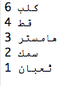

+ افتح Trinket الذي يحتوي على قالب Python فارغ: <a href="http://jumpto.cc/python-new" target="_blank">jumpto.cc/python-new</a>.

+ لنقم بإنشاء مخطط دائري لإظهار نتائج الاستبيان الخاص بك. ستستخدم مكتبة PyGal لجعل المهمة أسهل و للقيام بالعمل الصعب.
    
    قم أولاً باستيراد مكتبة Pygal:
    
    

+ الآن لنقم بإنشاء مخطط دائري و نصدره (نعرضه):
    
    
    
    لا تقلق ، سيكون مثيراً أكثر عند إضافة البيانات!

+ دعونا نضيف في البيانات لأحد الحيوانات الأليفة. استخدم البيانات التي جمعتها.
    
    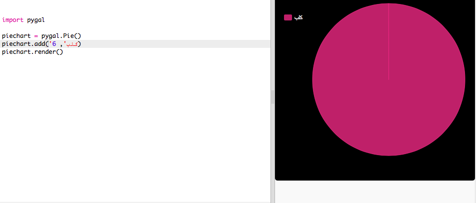
    
    لا يوجد سوى جزء واحد من البيانات لذلك سوف يستغرق المخطط الدائري بكامله.

+ الآن قم بإضافة بقية البيانات بنفس الطريقة.
    
    مثال:
    
    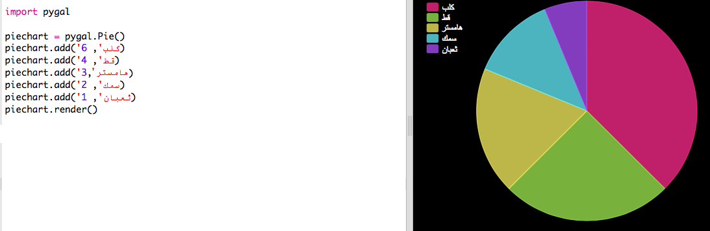

+ ولإنهاء المخطط ، أضف عنوانًا:
    
    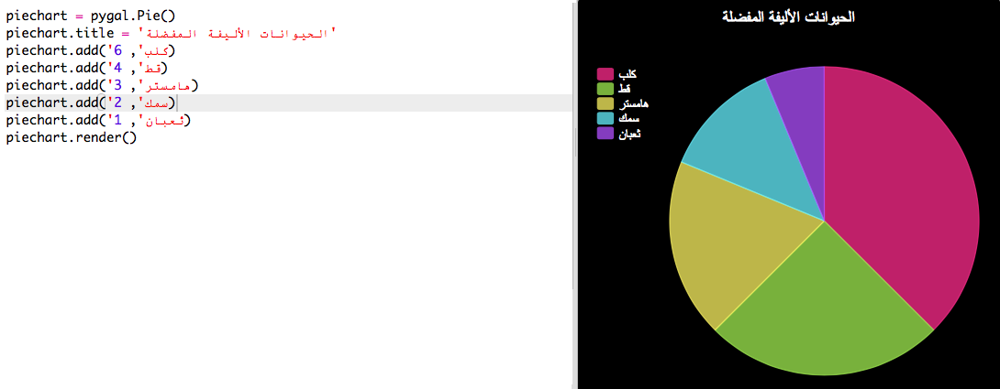

## احفظ مشروعك {.save}

## التحدي: إنشاء رسم بياني على شكل أعمدة {.challenge}

يمكنك إنشاء رسم بياني على شكل أعمدة بطريقة مماثلة. ما عليك سوى استخدام `barchart = pygal.Bar ()` لإنشاء رسم بياني جديد ، ثم قم بإضافة البيانات وعرضها بنفس طريقة التخطيط الدائري.

جمع البيانات من أعضاء Code Club لإنشاء رسم بياني على شكل أعمدة.

تأكد من اختيار موضوع يعرفه الجميع!

إليك بعض الأفكار:

+ ما هي رياضتك المفضلة؟

+ ما هي نكهة الآيس كريم المفضلة لديك؟

+ كيف تصل إلى المدرسة؟

+ ما هو شهر عيد ميلادك؟

+ هل لعب ماين كرافت (Minecraft)؟ (نعم / لا)

لا تطرح أسئلة التي تقدم بيانات شخصية، مثل ما هو عنوانك؟ اسأل قائد النادي إذا كنت غير متأكد.

أمثلة:

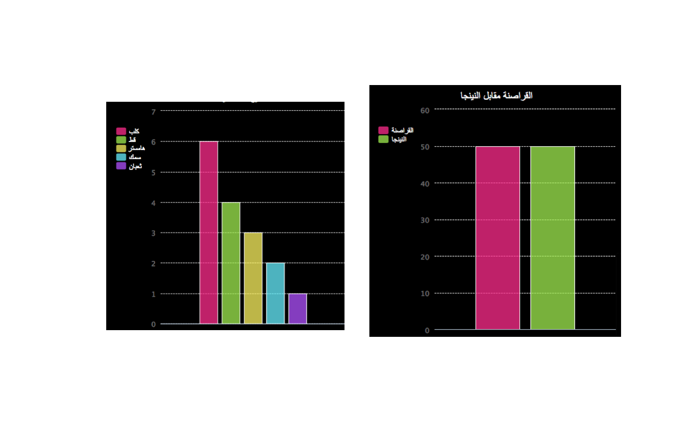

## احفظ مشروعك {.save}

# الخطوة 2: قراءة البيانات من ملف {.activity}

من المفيد أن تكون قادرًا على تخزين البيانات في ملف بدلاً من الاضطرار إلى تضمينها في الكود.

## قائمة مراجعة النشاط {.check}

+ أضف صفحة جديدة إلى مشروعك وسمِّها `pets.txt`:
    
    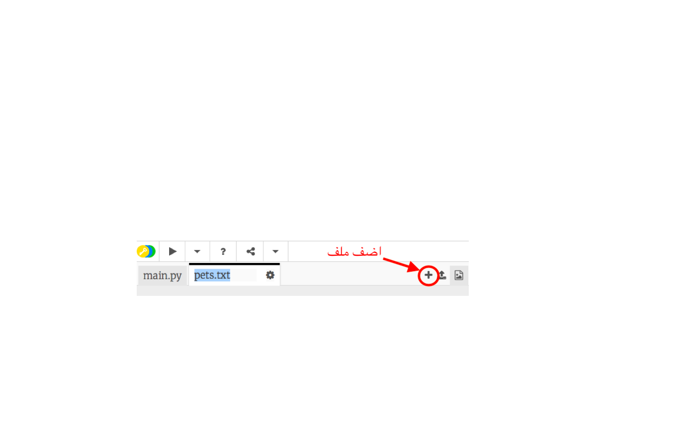

+ الآن قم بإضافة البيانات إلى الملف. يمكنك استخدام بيانات الحيوانات الأليفة المفضلة التي قمت بجمعها أو استخدام بيانات مثال.
    
    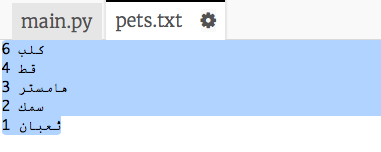

+ عد مرة أخرى إلى `main.py` وقم بالتعليق على الخطوط التي تقدم (تعرض) المخططات والرسوم البيانية (بحيث لا تعرض):
    
    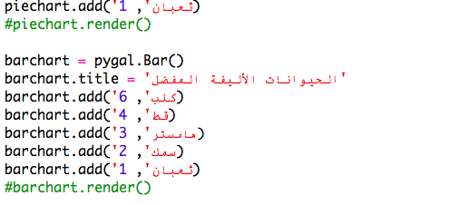

+ الآن دعونا نقرأ البيانات من الملف.
    
    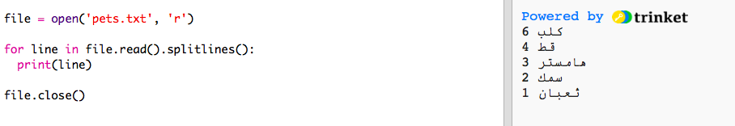
    
    حلقة `for` سوف تمضي عبر السطور الموجودة في الملف. `splitlines()` تزيل علامة السطر الجديد من نهاية السطر كما لو لم تُردْها.

+ يجب فصل كل سطر إلى ملصق وقيمة:
    
    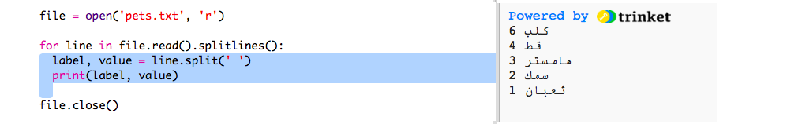
    
    سيؤدي ذلك إلى تقسيم السطر في المسافات لذا لا تتضمن مسافات في التسميات. (يمكنك إضافة دعم للمسافات في التسميات لاحقًا.)

+ قد تحصل على خطأ مثل هذا:
    
    
    
    يحدث هذا إذا كان لديك سطر فارغ في نهاية الملف.
    
    يمكنك إصلاح الخطأ من خلال الحصول على التسمية والقيمة فقط إذا لم يكن السطر فارغا.
    
    للقيام بذلك ،ضع مسافة بادئة في الكود داخل `for` وإضافة الشرط `if line:` فوقها:
    
    

+ يمكنك إزالة `print(label, value)` الآن كل شيء ينبغي أن يعمل.

+ الآن ، دعونا نضيف التصنيف والقيمة إلى مخطط دائري جديد ونعرضه:
    
    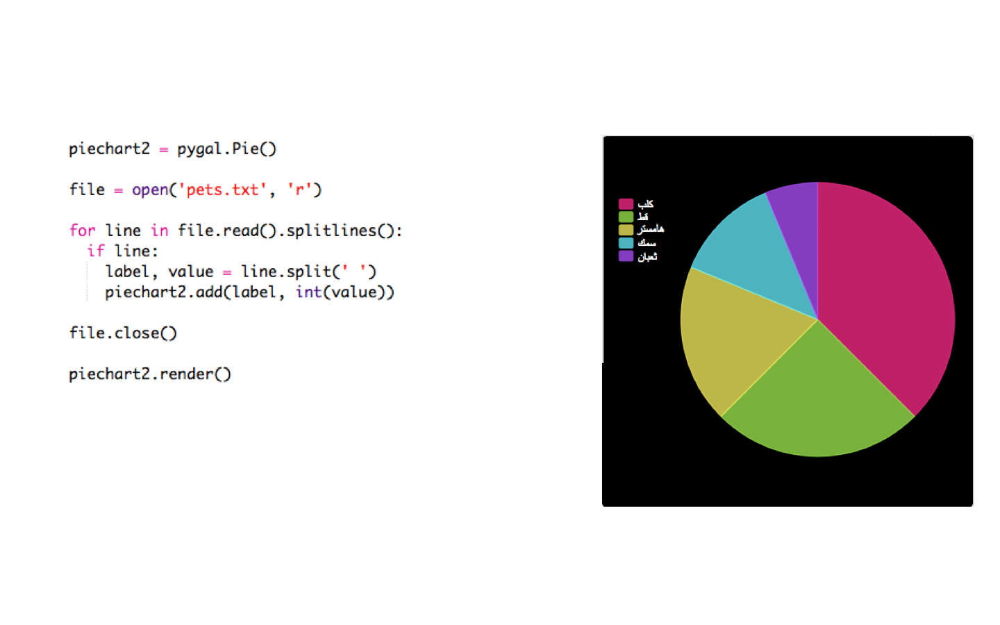
    
    لاحظ أن `add` تتوقع أن تكون القيمة رقمًا، `int(value)` تحول القيمة من سلسلة إلى عدد صحيح.
    
    إذا كنت تريد استخدام الكسور العشرية مثل 3.5، فيمكنك استخدام `float(value)` في ذلك الحين.

## احفظ مشروعك {.save}

## التحدي: إنشاء مخطط جديد من ملف {.challenge}

هل يمكنك إنشاء رسم بياني على شكل أعمدة أو مخطط دائري جديد من البيانات في ملف؟ ستحتاج إلى إنشاء ملف .txt جديد.

نصيحة: إذا كنت ترغب في الحصول على مسافات في التسميات ، فاستخدم `line.split (':')` و إضافة نقطتين إلى ملف البيانات الخاص بك ، على سبيل المثال "الأميرة الحمراء: 6"

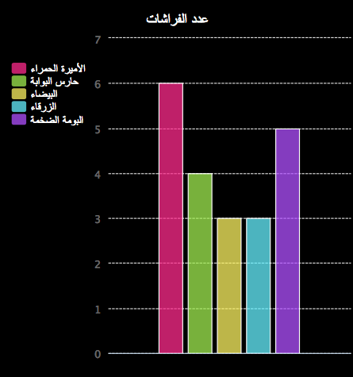

## احفظ مشروعك {.save}

## التحدي: المزيد من الرسوم البيانية! {.challenge}

هل يمكنك إنشاء مخطط دائري و رسم بياني على شكل أعمدة من نفس الملف؟ يمكنك استخدام البيانات التي جمعتها سابقًا أو جمع بعض البيانات الجديدة.

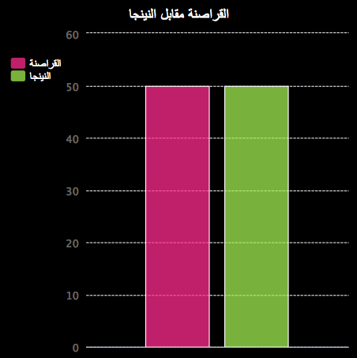

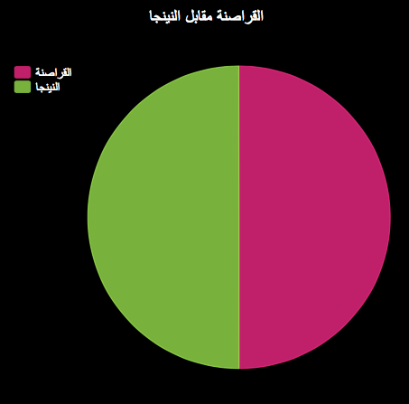

## احفظ مشروعك {.save}