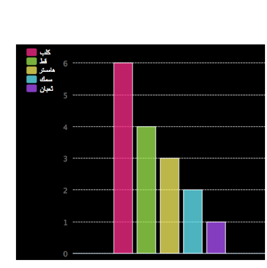

# المقدمة {.intro}

في هذا المشروع ، تقوم بإنشاء مخططات دائرية ورسومات بيانية على شكل أعمدة من البيانات التي تجمعها من أعضاء Code Club الخاص بك.

  <iframe src="https://trinket.io/embed/python/70d24d92b8?outputOnly=true&start=result" width="600" height="500" frameborder="0" marginwidth="0" marginheight="0" allowfullscreen>
  </iframe>
  

# الخطوة 1: إنشاء مخطط دائري {.activity}

المخططات الدائرية هي طريقة مفيدة لعرض البيانات. دعنا نجري استبيانا للحيوانات الأليفة المفضلة في Code Club ، ثم اعرض البيانات على شكل مخطط دائري.

## قائمة مراجعة النشاط {.check}

+ اطلب من المتطوع مساعدتك على إجراء استطلاع. ويمكنك تسجيل النتائج على جهاز كمبيوتر متصل بجهاز عرض أو على سبورة بيضاء تكون واضحة للجميع.
    
    اكتب قائمة بالحيوانات الأليفة وتأكد من أنها تتضمن الحيوان الأليف المفضل لدى كل شخص.
    
    ثم اطلب من كل شخص التصويت برفع يده للحيوان المفضل لديه عندما يتم ذكره، بحيث يُسمح لكل شخص بتصويت واحد فقط!
    
    على سبيل المثال:
    
    

+ افتح Trinket الذي يحتوي على قالب Python فارغ: <a href="http://jumpto.cc/python-new" target="_blank">jumpto.cc/python-new</a>.

+ لنقم بإنشاء مخطط دائري لإظهار نتائج الاستبيان الخاص بك. ستستخدم مكتبة PyGal لإنجاز بعض المهام الصعبة.
    
    أولًا، قم باستيراد مكتبة Pygal:
    
    

+ لنقم الآن بإنشاء مخطط دائري وعرضه (إظهاره):
    
    
    
    لا تقلق ، سيكون مثيراً أكثر عند إضافة البيانات!

+ دعونا نضيف في البيانات لأحد الحيوانات الأليفة. استخدم البيانات التي جمعتها.
    
    
    
    يوجد جزء واحد من البيانات، لذا سيشغل هذا الجزء المخططَ الدائري كله.

+ الآن قم بإضافة بقية البيانات بنفس الطريقة.
    
    على سبيل المثال:
    
    

+ ولإنهاء المخطط ، أضف عنوانًا:
    
    

## احفظ مشروعك {.save}

## التحدي: إنشاء رسم بياني على شكل أعمدة {.challenge}

يمكنك إنشاء رسم بياني على شكل أعمدة بطريقة مماثلة. ما عليك سوى استخدام الدالة `barchart = pygal.Bar()` لإنشاء مخطط جديد على شكل أعمدة، ثم إضافة البيانات وعرضها بالطريقة نفسها التي استخدمتها مع المخطط الدائري.

اجمع البيانات من أعضاء Code Club لإنشاء رسم بياني على شكل أعمدة.

تأكد من اختيار موضوع يعرفه الجميع!

إليك بعض الأفكار:

+ ما هي رياضتك المفضلة؟

+ ما هي نكهة الآيس كريم المفضلة لديك؟

+ كيف تصل إلى المدرسة؟

+ ما هو شهر عيد ميلادك؟

+ هل تلعب لعبة ماين كرافت؟ (نعم/لا)

لا تطرح أسئلة تكشف عن بيانات شخصية، مثل مكان السكن أو الإقامة. وإذا لم تكن متأكدًا، فيمكنك استشارة قائد النادي.

أمثلة:

## احفظ مشروعك {.save}

# الخطوة 2: قراءة البيانات من ملف {.activity}

من المفيد أن تكون قادرًا على تخزين البيانات في ملف بدلاً من الاضطرار إلى تضمينها في الكود.

## قائمة مراجعة النشاط {.check}

+ أضف ملفاً جديداً إلى مشروعك وسمِّه `pets.txt`:
    
    

+ أضف البيانات الآن إلى الملف. يمكنك استخدام البيانات التي جمعتها في استطلاعك عن الحيوانات الأليفة المفضلة أو يمكنك استخدام نموذج البيانات.
    
    

+ عد إلى الملف `main.py`وقم بتعليق الأسطر التي تعرض (تُظهر) المخططات والرسومات البيانية (بحيث لا يتم إظهارها):
    
    

+ لنقم الآن بقراءة البيانات من الملف.
    
    
    
    ستقوم حلقة `for` بتكرار الأمر ليشمل الأسطر الموجودة في الملف. وستحذف الدالة `splitlines()`حرفَ السطر الجديد من نهاية السطر لأنك لا تريد عرضه.

+ سنحتاج إلى تقسيم كل سطر إلى تسمية وقيمة:
    
    
    
    ستقوم هذه التعليمة البرمجية بتقسيم الأسطر عند المسافات لأنك لا تريد تضمين هذه المسافات في التسميات. (يمكنك إضافة تعليمة برمجية تدعم تضمين المسافات في التسميات لاحقًا)

+ قد تحصل على خطأ مثل هذا:
    
    
    
    يحدث هذا إذا كان لديك سطر فارغ في نهاية الملف.
    
    يمكنك إصلاح الخطأ من خلال الحصول على التسمية والقيمة فقط إذا لم يكن السطر فارغا.
    
    لتفعل ذلك، أدخل مسافة بادئة قبل التعليمات البرمجية الموجودة داخل حلقة `for`وأضف التعليمة البرمجية `if line:`أعلاها:
    
    

+ يمكنك حذف `print(label, value)` الآن وستعمل كل التعليمات البرمجية بشكل صحيح.

+ لنقم الآن بإضافة التسميات والقيم إلى مخطط دائري جديد وعرض المخطط:
    
    
    
    لاحظ أن `add` تتوقع أن تكون القيمة عدداً، لذا ستحوِّل`int(value)` القيمة من سلسلة نصية إلى عدد صحيح.
    
    إذا كنت تريد استخدام الكسور العشرية مثل 3.5 (أعداد الفاصلة العائمة)، فيمكنك استخدام `float(value)` كبديل.

## احفظ مشروعك {.save}

## التحدي: إنشاء مخطط جديد من ملف {.challenge}

هل يمكنك إنشاء رسم بياني على شكل أعمدة أو مخطط دائري جديد من البيانات في ملف؟ ستحتاج إلى إنشاء ملف .txt جديد.

نصيحة: إذا كنت ترغب في الحصول على مسافات في التسميات ، فاستخدم `line.split (':')` و إضافة نقطتين إلى ملف البيانات الخاص بك ، على سبيل المثال "الأميرة الحمراء: 6"

## احفظ مشروعك {.save}

## التحدي: مخططات ورسومات بيانية أخرى! {.challenge}

هل يمكنك إنشاء مخطط دائري و رسم بياني على شكل أعمدة من نفس الملف؟ يمكنك استخدام البيانات التي جمعتها سابقًا أو جمع بعض البيانات الجديدة.

## احفظ مشروعك {.save}