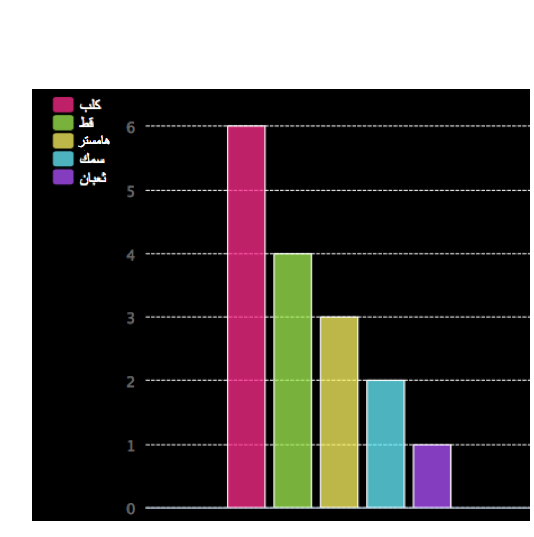

## المقدمة

في هذا المشروع، ستنشئ مخططات دائرية ورسومات بيانية على شكل أعمدة من البيانات التي تجمعها من أعضاء نادي Code Club.  

  <iframe src="https://trinket.io/embed/python/70d24d92b8?outputOnly=true&start=result" width="600" height="500" frameborder="0" marginwidth="0" marginheight="0" allowfullscreen>
  </iframe>
  

### معلومات إضافية لقادة النادي

إذا كنت بحاجة إلى طباعة هذا المشروع، فيُرجى استخدام [نسخة سهلة الطباعة](https://projects.raspberrypi.org/en/projects/popular-pets/print).

--- collapse ---
---
title: ملاحظات قادة النادي
---

## المقدمة:
يستخدم هذا المشروع الوحدة التدريبية لمخططات مكتبة Pygal ورسوماتها البيانية لعرض البيانات. حيث يجمع الأطفال البيانات ويستخدمون مكتبة Pygal لعرض هذه البيانات باستخدام المخططات الدائرية والرسومات البيانية التي على شكل أعمدة.  

## الموارد المتوفرة على الإنترنت

__يستخدم هذا المشروع Python 3.__ نوصي باستخدام [trinket](https://trinket.io/) لكتابة Python على الإنترنت. يحتوي هذا المشروع على Trinket التالية:

+ ['الحيوانات الأليفة المفضلة' مشروع البدء -- jumpto.cc/python-new](http://jumpto.cc/python-new)

كما يوجد مشروع trinket يحتوي على نموذج حل للتحديات:

+ [مشروع 'الحيوانات الأليفة المفضلة' مُكتمل trinket.io/python/9339862606](https://trinket.io/python/9339862606)

## الموارد المتوفرة دون اتصال بالإنترنت
يمكن أن يكون هذا المشروع [مكتمل دون اتصال بالإنترنت] (https://www.codeclubprojects.org/en-GB/resources/python-working-offline/) إذا كنت تفضل ذلك. يمكنك الوصول إلى موارد المشروع من خلال النقر فوق رابط "مواد المشروع" الخاص بهذا المشروع. يحتوي هذا الرابط على قسم "موارد المشروع"، الذي يتضمن الموارد التي يحتاج إليها الأطفال لإكمال هذا المشروع دون الاتصال بالإنترنت. تأكد من أن كل طفل لديه حق الوصول إلى نسخة من هذه الموارد. يتضمن هذا القسم الملفات التالية:

+ popular-pets/popular-pets.py

يمكنك أيضًا العثور على نسخة كاملة من تحديات هذا المشروع في قسم "موارد المتطوعين" الذي يحتوي على:

+ popular-pets-finished/popular-pets.py
+ popular-pets-finished/pets.txt
+ popular-pets-finished/butterflies.txt
+ popular-pets-finished/piratesinjas.txt

(جميع الموارد المذكورة أعلاه قابلة للتنزيل أيضًا كملفات `.zip` للمشاريع والمتطوعين).

## أهداف التعلم
+ البيانات - مخططات مكتبة Pygal ورسوماتها البيانية
+ قراءة البيانات من الملفات

يتناول هذا المشروع عناصر من الصفوف التالية من [المناهج الرقمية الخاصة بـ Raspberry Pi](http://rpf.io/curriculum):

+ [دمج الإنشاءات البرمجية لحل مشكلة].(https://www.raspberrypi.org/curriculum/programming/builder)

## التحديات:
+ أنشئ مخططًا على شكل أعمدة؛
+ أنشئ مخططًا جديدًا على شكل أعمدة من ملف؛
+ مخططات ورسومات بيانية أخرى!

## الأسئلة الشائعة
+ تطلب الخطوة الأولى من المتطوعين مساعدة المجموعة على إجراء استطلاع لجمع بيانات عن الحيوانات الأليفة المفضلة. إذا كان عدد الأطفال الذين يعملون في المشروع قليلًا، فيمكنك استخدام نموذج البيانات الموجود مع المشروع أو وضع بيانات من عندك.
+ بالنسبة إلى التحديات، يمكنكم إجراء الاستطلاعات كمجموعة وتسجيل النتائج على سبورة بيضاء ليستخدمها كل أعضاء النادي، أو يمكنك السماح للأطفال بإجراء استطلاعاتهم وتسجيل البيانات التي يجمعونها.

--- /collapse ---

--- collapse ---
---
title: مواد المشروع
---
## موارد المشروع
* [ملف .zip يحتوي على جميع موارد المشروع](resources/popular-pets-project-resources.zip)
* [Python Trinket فارغة متصلة بالإنترنت](http://jumpto.cc/python-new)
* [ملف Python فارغ متوفر دون اتصال بالإنترنت](resources/new-new.py)

## موارد قادة النادي
* [ملف .zip يحتوي على جميع موارد المشاريع المكتملة](resources/popular-pets-volunteer-resources.zip)
* [مشروع Trinket المكتمل على الإنترنت](https://trinket.io/python/70d24d92b8)
* [popular-pets-finished/popular-pets.py](resources/popular-pets-finished-popular-pets.py)
* [popular-pets-finished/pets.txt](resources/popular-pets-finished-pets.txt)
* [popular-pets-finished/butterflies.txt](resources/popular-pets-finished-butterflies.txt)
* [popular-pets-finished/piratesninjas.txt](resources/popular-pets-finished-piratesninjas.txt)

--- /collapse ---
