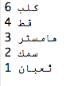

## إنشاء مخطط دائري

تعد المخططات الدائرية طريقة مفيدة في عرض البيانات. لنقم بإجراء استطلاع عن الحيوانات الأليفة المفضلة في Code Club ثم تمثيل البيانات باستخدام مخطط دائري.

+ اطلب من المتطوع مساعدتك على إجراء استطلاع. ويمكنك تسجيل النتائج على جهاز كمبيوتر متصل ببروجيكتور أو على سبورة بيضاء تكون واضحة للكل.

  اكتب قائمة بالحيوانات الأليفة وتأكد من أنها تتضمن الحيوان الأليف المفضل لدى كل شخص.

  ثم اطلب من كل شخص التصويت برفع يده للحيوان المفضل لديه عندما يتم ذكره، بحيث يُسمح لكل شخص بتصويت واحد فقط!

  على سبيل المثال:

  

افتح Trinket الذي يحتوي على قالب Python فارغ: <a href="http://jumpto.cc/python-new" target="_blank">jumpto.cc/python-new</a>.

+ لننشئ مخططًا دائريًا لعرض نتائج الاستطلاع. ستستخدم مكتبة PyGal لإنجاز بعض المهام الصعبة.

  أولًا، قم باستيراد مكتبة Pygal:

  

+ لنقم الآن بإنشاء مخطط دائري وعرضه (إظهاره):

  

  لا تقلق، ستكون إضافة البيانات عملية سهلة!

+ لنُدخل البيانات الخاصة بحيوان أليف واحد. استخدم البيانات التي جمعتها.

  

  يوجد جزء واحد من البيانات، لذا سيشغل هذا الجزء المخططَ الدائري كله.

+ أضف الآن البيانات الأخرى بالطريقة نفسها.

  على سبيل المثال:

  

+ أضف عنوانًا إلى المخطط كخطوة أخيرة:

  

