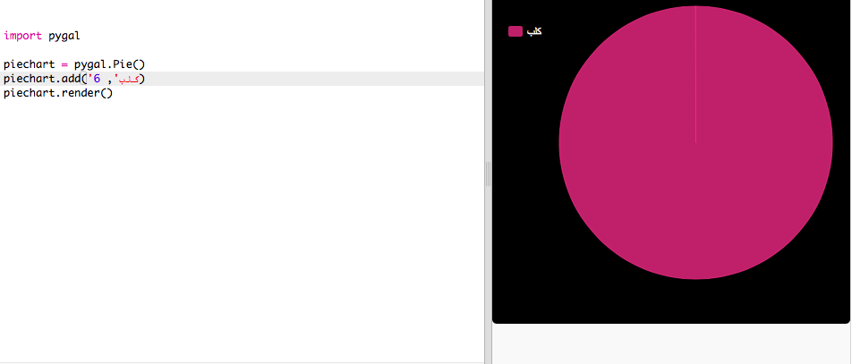

## إنشاء مخطط دائري

Pie Charts are useful way of showing data. لنقم بإستطلاع للحيوانات الأليفة المفضلة في Code Club، ثم قدم البيانات على شكل مخطط دائري.

+ اطلب من قائد النادي للمساعدة في تنظيم استطلاع. يمكنك تسجيل النتائج على جهاز كمبيوتر متصل بجهاز عرض أو لوحة بيضاء يمكن للجميع رؤيتها.
    
    اكتب قائمة بالحيوانات الأليفة وتأكد من تضمين الحيوانات الأليفة المفضلة للجميع.
    
    ثم اطلب من الجميع التصويت لصالح حيوانهم الأليف المفضل من خلال رفع أيديهم عندما يسمعونها. كل فرد يحصل على صوت واحد فقط!
    
    مثال:
    
    

+ افتح Trinket الذي يحتوي على قالب Python فارغ: <a href="http://jumpto.cc/python-new" target="_blank">jumpto.cc/python-new</a>.

+ لنقم بإنشاء مخطط دائري لإظهار نتائج الاستبيان الخاص بك. سوف تستخدم مكتبة PyGal للقيام ببعض الأعمال الصعبة.
    
    قم أولاً باستيراد مكتبة Pygal:
    
    

+ الآن لنقم بإنشاء مخطط دائري و نصدره (نعرضه):
    
    
    
    لا تقلق ، يصبح أكثر إثارة للاهتمام عند إضافة البيانات!

+ دعونا نضيف في البيانات لأحد الحيوانات الأليفة. استخدم البيانات التي جمعتها.
    
    
    
    لا يوجد سوى جزء واحد من البيانات لذلك سوف يستغرق المخطط الدائري بكامله.

+ الآن قم بإضافة بقية البيانات بنفس الطريقة.
    
    مثال:
    
    

+ ولإنهاء المخطط ، أضف عنوانًا:
    
    