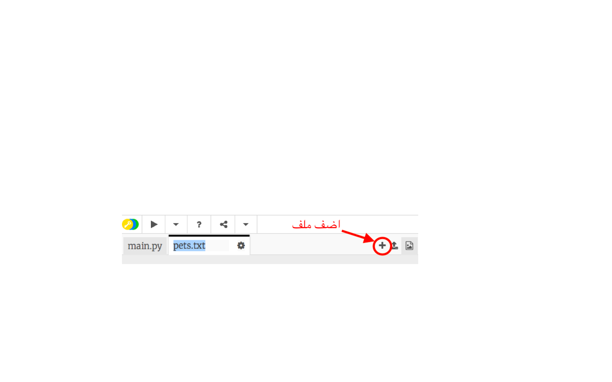
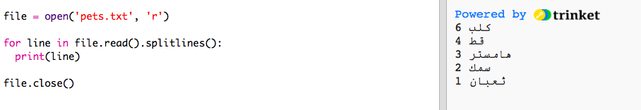
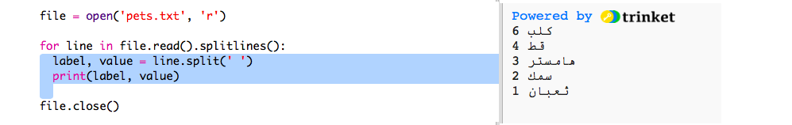

## قراءة البيانات من ملف

سيكون من الأفضل تسجيل البيانات في ملف بدلًا من الحاجة إلى تضمينها في التعليمات البرمجية.

+ أضف ملفًا جديدًا إلى مشروعك وسمِّه `pets.txt`:

  

+ أضف البيانات الآن إلى الملف. يمكنك استخدام البيانات التي جمعتها في استطلاعك عن الحيوانات الأليفة المفضلة أو يمكنك استخدام نموذج البيانات.

  

+ عُد إلى الملف `main.py` وقم بتعليق الأسطر التي تعرض (تُظهر) المخططات والرسومات البيانية (بحيث لا يتم إظهارها):

  

+ لنقم الآن بكتابة التعليمات البرمجية لقراءة البيانات من الملف.

  

  ستقوم حلقة `for` بتكرار الأمر ليشمل الأسطر الموجودة في الملف. وستحذف الدالة `()splitlines` حرفَ السطر الجديد من نهاية السطر لأنك لا تريد عرضه.

+ سنحتاج إلى تقسيم كل سطر إلى تسمية وقيمة:

  

  ستقوم هذه التعليمة البرمجية بتقسيم الأسطر عند المسافات لأنك لا تريد تضمين هذه المسافات في التسميات. (يمكنك إضافة تعليمة برمجية تدعم تضمين المسافات في التسميات لاحقًا).

+ قد يظهر لك خطأ كالخطأ التالي:

  

  يحدث هذا الخطأ إذا كان هناك سطر فارغ في نهاية الملف.

  يمكنك إصلاح هذا الخطأ باستيراد التسمية والقيمة إذا لم يكن السطر فارغًا.

  لتفعل ذلك، أدخل مسافة بادئة قبل التعليمات البرمجية الموجودة داخل حلقة `for` وأضف التعليمة البرمجية `if line:` أعلاها:

  

+ يمكنك حذف السطر `print(label, value)` الآن وستعمل كل التعليمات البرمجية بشكل صحيح.

+ لنقم الآن بإضافة التسميات والقيم إلى مخطط دائري جديد وعرض المخطط:

  

  لاحظ أن `add` تتوقع أن تكون القيمة عددًا، لذا ستحوِّل `int(value)` القيمة من سلسلة نصية إلى عدد صحيح.

  إذا أردتَ استخدام كسور عشرية مثل 3.5 (أعداد الفاصلة العائمة)، فيمكنك استخدام `float(value)` بدلًا من `int(value)`.

