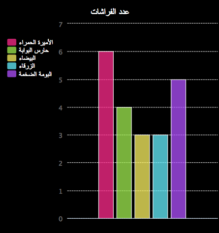

--- challenge ---
## التحدي: أنشئ مخططًا جديدًا من ملف

هل يمكنك إنشاء رسم بياني على شكل أعمدة أو مخطط دائري جديد من بيانات في ملف؟ ستحتاج إلى إنشاء ملف txt. جديد.

تلميح: إذا كنت تريد تضمين المسافات في التسميات، فاستخدم `line.split(': ')` وأضف علامات (:) إلى ملف البيانات، مثل 'Red Admiral: 6'

--- /challenge ---