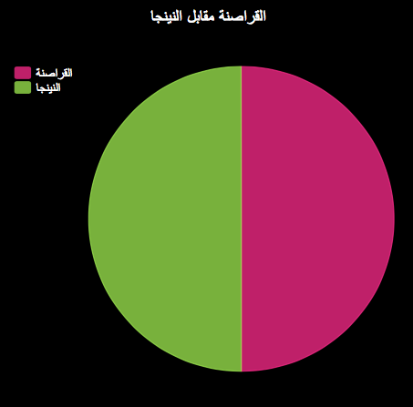

--- challenge ---

## التحدي: مخططات ورسومات بيانية أخرى!

هل يمكنك إنشاء مخطط دائري و رسومات بيانية على شكل أعمدة من نفس الملف؟ يمكنك استخدام البيانات التي جمعتها سابقًا أو جمع بعض البيانات الجديدة.

--- /challenge ---

***
تمت ترجمة هذا المشروع بواسطة متطوعين:

خالد علي

علا محمد جزماتي

بفضل المتطوعين ، يمكننا إعطاء الناس في جميع أنحاء العالم فرصة للتعلم بلغتهم الخاصة. يمكنك مساعدتنا في الوصول إلى المزيد من الأشخاص من خلال التطوع للترجمة - مزيد من المعلومات على [rpf.io/translate](https://rpf.io/translate).