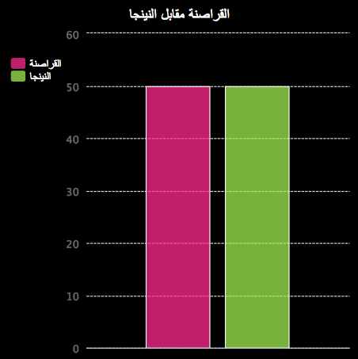

\--- challenge \---

## التحدي: المزيد من الرسوم البيانية!

هل يمكنك إنشاء مخطط دائري و رسومات بيانية على شكل أعمدة من نفس الملف؟ يمكنك استخدام البيانات التي جمعتها سابقًا أو جمع بعض البيانات الجديدة.

\--- challenge/ \---