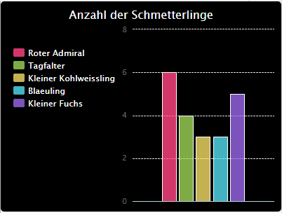

# Einleitung {.intro}

In diesem Projekt wirst du Tortendiagramme und Balkendiagramme aus Daten erstellen, welche du von Mitgliedern deines Code Clubs gesammelt hast.

  <iframe src="https://trinket.io/embed/python/70d24d92b8?outputOnly=true&start=result" width="600" height="500" frameborder="0" marginwidth="0" marginheight="0" allowfullscreen>
  </iframe>
  

# Schritt 1: Erstelle ein Kreisdiagramm {.activity}

Kreisdiagramme sind eine nützliche Methode zum Anzeigen von Daten. Lass uns eine Umfrage über die Lieblingstiere in deinem Code Club durchführen und die Daten als Tortendiagramm darstellen.

## Aufgaben-Checkliste {.check}

+ Bitten Sie einen Freiwilligen, eine Umfrage zu organisieren. Sie können die Ergebnisse auf einem Computer aufzeichnen, der an einen Projektor oder ein Whiteboard angeschlossen ist und von jedem gesehen werden kann.
    
    Schreiben Sie eine Liste mit Haustieren und vergewissern Sie sich, dass jeder Liebling dabei ist.
    
    Bringen Sie dann alle dazu, für ihren Favoriten zu stimmen, indem Sie die Hand nach dem Aufruf heben. Nur jeweils eine Stimme!
    
    Zum Beispiel:
    
    

+ Öffne das leere Python-Vorlage-Trinket: <a href="http://jumpto.cc/python-new" target="_blank">jumpto.cc/python-new</a>.

+ Lassen Sie uns ein Kreisdiagramm erstellen, um die Ergebnisse Ihrer Umfrage anzuzeigen. Sie werden die PyGal-Bibliothek verwenden, um einen Teil der harten Arbeit zu erledigen.
    
    Importieren Sie zuerst die Pygal-Bibliothek:
    
    

+ Jetzt erstellen wir ein Kreisdiagramm und rendern es (zeigen es an):
    
    
    
    Keine Sorge, es wird interessanter, wenn Sie Daten hinzufügen!

+ Lassen Sie uns die Daten für eines der Haustiere hinzufügen. Verwenden Sie die von Ihnen gesammelten Daten.
    
    
    
    Es gibt nur ein Datenelement, sodass es das gesamte Kreisdiagramm einnimmt.

+ Fügen Sie nun den Rest der Daten auf die gleiche Weise hinzu.
    
    Zum Beispiel:
    
    

+ Und um Ihr Diagramm zu vervollständigen, fügen Sie einen Titel hinzu:
    
    

## Speichern Sie Ihr Projekt {.save}

## Daten von einer Datei ablesen {.challenge}

Sie können Balkendiagramme auf ähnliche Weise erstellen. Verwenden Sie einfach `barchart = pygal.Bar ()` , um ein neues Balkendiagramm zu erstellen, fügen Sie Daten hinzu und rendern Sie es wie für ein Kreisdiagramm.

Sammeln Sie Daten von Ihren Code Club-Mitgliedern, um Ihr eigenes Balkendiagramm zu erstellen.

Stellen Sie sicher, dass Sie ein Thema auswählen, über das jeder Bescheid weiß!

Hier sind ein paar Vorschläge:

+ Was ist dein Lieblingssport?

+ Was ist Ihr Lieblingseisgeschmack?

+ Wie kommst du zur Schule?

+ In welchem Monat hast du Geburtstag?

+ Spielst du Minecraft? (ja Nein)

Stellen Sie keine Fragen, die personenbezogene Daten enthalten, z. B. wo Menschen leben. Fragen Sie Ihren Clubleiter, wenn Sie sich nicht sicher sind.

Beispiele:

## Speichern Sie Ihr Projekt {.save}

# Schritt 2: Daten aus einer Datei lesen {.activity}

Es ist nützlich, Daten in einer Datei speichern zu können, anstatt sie in den Code aufnehmen zu müssen.

## Aktivitäts-Checkliste {.check}

+ Fügen Sie Ihrem Projekt eine neue Datei hinzu und nennen Sie sie `pets.txt`:
    
    

+ Fügen Sie nun der Datei Daten hinzu. Sie können die von Ihnen gesammelten Lieblingshaustierdaten oder die Beispieldaten verwenden.
    
    

+ Wechseln Sie zurück zu `main.py` und kommentieren Sie die Linien aus, die Diagramme und Grafiken rendern (anzeigen) (damit sie nicht angezeigt werden):
    
    

+ Lesen wir nun die Daten aus der Datei.
    
    
    
    Die `für` Schleife durchläuft die Zeilen in der Datei. `splitlines ()` entfernt das Zeilenumbruchzeichen vom Zeilenende, da Sie das nicht wollen.

+ Jede Zeile muss in eine Bezeichnung und einen Wert getrennt werden:
    
    
    
    Dadurch wird die Linie an den Leerzeichen geteilt. Fügen Sie also keine Leerzeichen in die Beschriftungen ein. (Sie können später die Unterstützung für Leerzeichen in Beschriftungen hinzufügen.)

+ Möglicherweise erhalten Sie folgende Fehlermeldung:
    
    
    
    Dies passiert, wenn Sie am Ende Ihrer Datei eine leere Zeile haben.
    
    Sie können den Fehler beheben, indem Sie nur die Bezeichnung und den Wert abrufen, wenn die Zeile nicht leer ist.
    
    Um dies zu tun, rücken Sie den Code in Ihre `für` Schleife ein und fügen Sie den Code `wenn Zeile:` darüber:
    
    

+ Sie können die Zeile `print (label, value)` entfernen, jetzt funktioniert alles.

+ Fügen wir nun die Bezeichnung und den Wert zu einem neuen Kreisdiagramm hinzu und rendern Sie es:
    
    
    
    Beachten Sie, dass `add` ausgeht, dass der Wert eine Zahl ist. `int (value)` wandelt den Wert einer Zeichenfolge in eine Ganzzahl um.
    
    Wenn Sie Dezimalzahlen wie 3,5 (Gleitkommazahlen) verwenden möchten, können Sie stattdessen `float (Wert)` verwenden.

## Speichern Sie Ihr Projekt {.save}

## Aufgabe: Noch mehr Diagramme und Grafiken! {.challenge}

Können Sie aus Daten in einer Datei ein neues Balkendiagramm oder Tortendiagramm erstellen? Sie müssen eine neue TXT-Datei erstellen.

Tipp: Wenn Sie Leerzeichen in den Beschriftungen haben möchten, verwenden Sie `line.split (':')` und fügen Sie Ihrer Datendatei Doppelpunkte hinzu, z. B. 'Red Admiral: 6'.

## Speichern Sie Ihr Projekt {.save}

## Herausforderung: Mehr Diagramme und Grafiken! {.challenge}

Können Sie aus derselben Datei ein Kreisdiagramm und ein Balkendiagramm erstellen? Sie können entweder die zuvor gesammelten Daten verwenden oder einige neue Daten sammeln.

## Speichern Sie Ihr Projekt {.save}