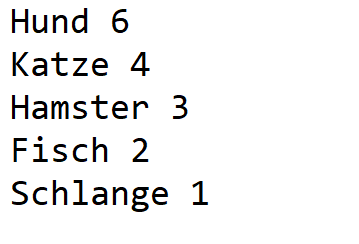
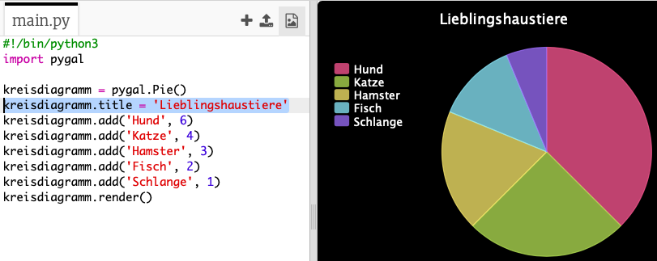
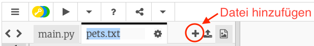
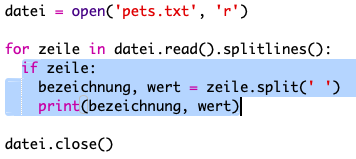

# Einleitung {.intro}

In diesem Projekt wirst du Tortendiagramme und Balkendiagramme aus Daten erstellen, welche du von Mitgliedern deines Code Clubs gesammelt hast.

  <iframe src="https://trinket.io/embed/python/70d24d92b8?outputOnly=true&start=result" width="600" height="500" frameborder="0" marginwidth="0" marginheight="0" allowfullscreen>
  </iframe>
  

# Schritt 1: Erstelle ein Kreisdiagramm {.activity}

Kreisdiagramme sind eine nützliche Methode zum Anzeigen von Daten. Lass uns eine Umfrage über die Lieblingstiere in deinem Code Club durchführen und die Daten als Tortendiagramm darstellen.

## Aufgaben-Checkliste {.check}

+ Bitte einen Freiwilligen, eine Umfrage zu organisieren. Du kannst die Ergebnisse auf einem Computer aufzeichnen, der an einen Projektor oder ein Whiteboard angeschlossen ist und von jedem gesehen werden kann.
    
    Schreibe eine Liste mit Haustieren und vergewissern dich, dass jeder Liebling dabei ist.
    
    Bringe dann alle dazu, für ihren Favoriten zu stimmen, indem du die Hand nach dem Aufruf heben. Nur jeweils eine Stimme!
    
    Zum Beispiel:
    
    

+ Öffne das leere Python-Vorlage-Trinket: <a href="http://jumpto.cc/python-new" target="_blank">jumpto.cc/python-new</a>.

+ Lass uns ein Kreisdiagramm erstellen, um die Ergebnisse deiner Umfrage anzuzeigen. Du wirst die PyGal-Bibliothek verwenden, um einen Teil der harten Arbeit zu erledigen.
    
    Importiere zuerst die Pygal-Bibliothek:
    
    

+ Jetzt erstellen wir ein Kreisdiagramm und rendern es (zeigen es an):
    
    
    
    Keine Sorge, es wird interessanter, wenn du Daten hinzufügst!

+ Lass uns die Daten für eines der Haustiere hinzufügen. Verwende die von Dir gesammelten Daten.
    
    
    
    Es gibt nur ein Datenelement, sodass es das gesamte Kreisdiagramm einnimmt.

+ Füge nun den Rest der Daten auf die gleiche Weise hinzu.
    
    Zum Beispiel:
    
    

+ Und um dein Diagramm zu vervollständigen, füge einen Titel hinzu:
    
    

## Speichere dein Projekt {.save}

## Daten von einer Datei ablesen {.challenge}

Du kannst Balkendiagramme auf ähnliche Weise erstellen. Verwende einfach `barchart = pygal.Bar ()`, um ein neues Balkendiagramm zu erstellen, füge Daten hinzu und rendern es wie für ein Kreisdiagramm.

Sammle Daten von deinen Code Club-Mitgliedern, um dein eigenes Balkendiagramm zu erstellen.

Stelle sicher, dass du ein Thema auswählst, über das jeder Bescheid weiß!

Hier sind ein paar Vorschläge:

+ Was ist dein Lieblingssport?

+ Was ist dein Lieblingseisgeschmack?

+ Wie kommst du zur Schule?

+ In welchem Monat hast du Geburtstag?

+ Spielst du Minecraft? (ja Nein)

Stelle keine Fragen, die personenbezogene Daten enthalten, z. B. wo Menschen leben. Frage deinen Clubleiter, wenn du dir nicht sicher bist.

Beispiele:

## Speichere dein Projekt {.save}

# Schritt 2: Daten aus einer Datei lesen {.activity}

Es ist nützlich, Daten in einer Datei speichern zu können, anstatt sie in den Code aufnehmen zu müssen.

## Aktivitäts-Checkliste {.check}

+ Füge zu deinem Projekt eine neue Datei hinzu und nenne sie `pets.txt`:
    
    

+ Füge nun der Datei Daten hinzu. Du kannst die von dir gesammelten Lieblingshaustierdaten oder die Beispieldaten verwenden.
    
    

+ Wechsel zurück zu `main.py` und kommentiere die Zeilen aus, welche Diagramme und Graphen rendern (anzeigen) (damit sie nicht angezeigt werden):
    
    

+ Lesen wir nun die Daten aus der Datei.
    
    
    
    Die `für` Schleife durchläuft die Zeilen in der Datei. `splitlines ()` entfernt das Zeilenumbruchzeichen vom Zeilenende, da Sie das nicht wollen.

+ Jede Zeile muss in eine Bezeichnung und einen Wert getrennt werden:
    
    
    
    Dadurch wird die Linie an den Leerzeichen geteilt. Füge also keine Leerzeichen in die Beschriftungen ein. (Du kannst später die Unterstützung für Leerzeichen in Beschriftungen hinzufügen.)

+ Möglicherweise erhälst du folgende Fehlermeldung:
    
    
    
    Dies passiert, wenn du am Ende deiner Datei eine leere Zeile hast.
    
    Du kannst den Fehler beheben, indem du nur die Bezeichnung und den Wert abrufst, wenn die Zeile nicht leer ist.
    
    Um dies zu tun, rücke den Code in deiner `für` Schleife ein und füge den Code `wenn Zeile:` darüber ein:
    
    

+ Du kannst die Zeile `print (label, value)` entfernen, jetzt funktioniert alles.

+ Fügen wir nun die Bezeichnung und den Wert zu einem neuen Kreisdiagramm hinzu und rendern es:
    
    
    
    Beachte, dass `add` davon ausgeht, dass der Wert eine Zahl ist. `int (value)` wandelt den Wert einer Zeichenfolge in eine Ganzzahl um.
    
    Wenn du Dezimalzahlen wie 3,5 (Gleitkommazahlen) verwenden möchtest, kannst du stattdessen `float (Wert)` verwenden.

## Speichere dein Projekt {.save}

## Aufgabe: Noch mehr Diagramme und Grafiken! {.challenge}

Kannst du aus den Daten in einer Datei ein neues Balkendiagramm oder Tortendiagramm erstellen? Du musst eine neue .txt-Datei erstellen.

Tipp: Wenn du Leerzeichen in den Beschriftungen haben möchtest, verwende `line.split (':')` und füge deiner Datendatei Doppelpunkte hinzu, z. B. 'Red Admiral: 6'

## Save Your Project {.save}

## Challenge: More charts and graphs! {.challenge}

Can you create a pie chart and a bar chart from the same file? You can either use the data you collected earlier or collect some new data.

## Save Your Project {.save}