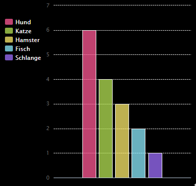

## Einleitung

In diesem Projekt erstellst du Kreis- und Balkendiagramme aus Daten, welche du von Mitgliedern deines Code Club gesammelt hast.

### Anweisungen

Wenn du auf Ausführen klickst, werden die Diagramme mithilfe des PyGal-Python-Moduls aus Daten erstellt.

  <iframe src="https://trinket.io/embed/python/70d24d92b8?outputOnly=true&start=result" width="600" height="500" frameborder="0" marginwidth="0" marginheight="0" allowfullscreen>
  </iframe>
  

### Was du lernen wirst

Dieses Projekt deckt Bestandteile folgender Zweige des [Raspberry Pi Digital Making Curriculum](http://rpf.io/curriculum) ab:

+ [Kombiniere zur Problemlösung verschiedene Programmierkonstrukte.](https://www.raspberrypi.org/curriculum/programming/builder/)

### Zusätzliche Informationen für Lehrer

Falls Sie dieses Projekt ausdrucken möchten, verwenden Sie bitte die [druckerfreundliche Version](https://projects.raspberrypi.org/en/projects/popular-pets/print){:target="_blank"}.

Verwenden Sie den Link in der Fußzeile, um auf das GitHub-Repository für dieses Projekt zuzugreifen. Dieses enthält alle Ressourcen (einschließlich eines Beispiels für ein fertiggestelltes Projekt) im Ordner "de-DE/resources".