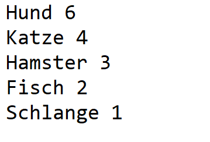
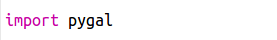
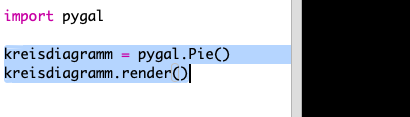
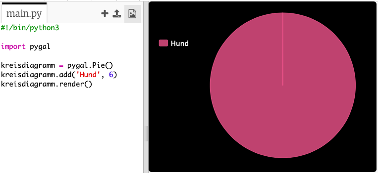
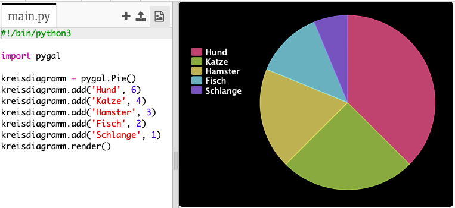
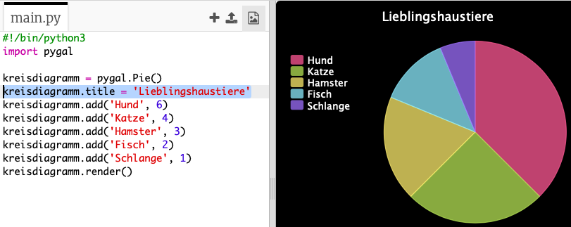

## Erstelle ein Kreisdiagramm

Kreisdiagramme sind eine hilfreiche Methode, um Daten bildlich darzustellen. Lass uns eine Umfrage über die Lieblingshaustiere in deinem Code Club machen und diese Daten dann als Kreisdiagramm darstellen. 

+ Bitte deinen Helfer, eine Umfrage zu organisieren. Du könntest deine Ergebnisse auf einem Computer aufzeichnen, der an einen Projektor oder an ein elektronisches Whiteboard angeschlossen ist, damit alle es sehen können. 

  Schreibe eine Liste an Haustieren und achte darauf, dass die Lieblingstiere von allen hier notiert werden. 
  
  Dann müssen alle per Handzeichen wählen, welches das Lieblingstier ist, wenn der Name dieses Tieres genannt wird. Jeder darf aber nur ein Tier wählen!
  
  Zum Beispiel:
  
  

+ Das leere Python Vorlage- Trinket öffnen: <a href="http://jumpto.cc/python-new" target="_blank">jumpto.cc/python-new</a>. 

+ Lass uns jetzt ein Kreisdiagramm erstellen, um die Ergebnisse deiner Umfrage aufzuzeichnen. Du wirst die Pygal Bibliothek für die komplizierteren Aspekte benutzen.

  Als erstes musst du die Pygal Bibliothek importieren:

  

+ Lass uns jetzt ein Kreisdiagramm erstellen und es rendern (anzeigen):

  
  
  Keine Sorge, es wird interessanter, wenn du die Daten hinzufügst!

+ Lass uns jetzt die Daten für eines der Haustiere hinzufügen. Benutze die Daten, die du gesammelt hast.

  
  
  Es gibt nur ein Set an Daten, daher nimmt es das gesamte Kreisdiagramm in Anspruch. 

+ Füge jetzt auf die gleiche Art die restlichen Daten hinzu. 

  Zum Beispiel:
  
  
  
+ Und um dein Diagramm zu vollenden, füge jetzt den Titel hinzu:

  
