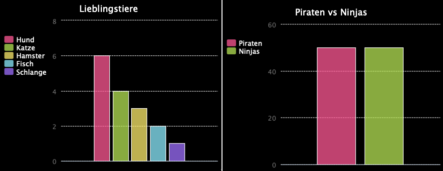

--- challenge ---
## Aufgabe: Erstelle dein eigenes Balkendiagramm 

Du kannst auf ähnliche Art und Weise auch ein Balkendiagramm erstellen. Benutze einfach nur `barchart = pygal.Bar()` (Balkendiagramm), um ein neues  Balkendiagramm zu erstellen, füge dann die Daten hinzu und rendere es auf die gleiche Art und Weise wie das Kreisdiagramm. 

Sammele die Daten von deinen Code Club Mitgliedern, um dein eigenes Balkendiagramm zu erstellen.

Achte darauf, dass du ein Thema wählst, über das jeder Bescheid weiß!

Hier sind ein paar Vorschläge:

+ Was ist dein Lieblingssport?
+ Welche Sorte Eiscreme magst du am liebsten?
+ Wie kommst du zur Schule?
+ In welchem Monat hast du Geburtstag?
+ Spielst du Minecraft? (ja/nein)

Stelle keine Fragen, bei denen persönliche Daten abgefragt werden, wie z.B. wo jemand wohnt. Frage deinen Club-Leiter, wenn du dir nicht sicher bist. 

Beispiele:

--- /challenge ---

