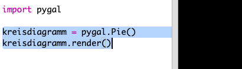
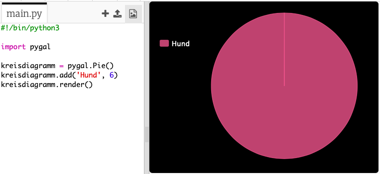

## Erstelle ein Kreisdiagramm

Kreisdiagramme sind eine nützliche Methode um Daten anzuzeigen. Lass uns eine Umfrage über die Lieblingstiere in deinem Code Club durchführen und das Ergebnis als Kreisdiagramm darstellen.

+ Bitte deinen Clubleiter, eine Umfrage zu organisieren. Du kannst die Ergebnisse in einen Computer eingeben, welcher an einen Projektor angeschlossen ist, oder an eine Tafel schreiben, die alle sehen können.
    
    Schreibe eine Liste mit Haustieren und stelle sicher, dass jeder Liebling dabei ist.
    
    Dann lasse alle für ihr Lieblingstier abstimmen indem sie ihre Hand heben, wenn es aufgerufen wird. Jeder hat nur eine Stimme!
    
    Zum Beispiel:
    
    

+ Öffne die leere Python-Vorlage in Trinket: <a href="http://jumpto.cc/python-new" target="_blank">jumpto.cc/python-new</a>.

+ Lass uns ein Kreisdiagramm erstellen, um die Ergebnisse deiner Umfrage anzuzeigen. Du wirst die PyGal-Bibliothek verwenden, die einen Teil der harten Arbeit erledigt.
    
    Importiere zuerst die PyGal-Bibliothek:
    
    

+ Jetzt erstellen wir ein Kreisdiagramm und rendern es (zeigen es an):
    
    
    
    Keine Sorge, es wird interessanter, wenn Du Daten hinzufügst!

+ Lass uns die Daten für eines der Haustiere einfügen. Verwende die Daten, welche Du gesammelt hast.
    
    
    
    Es gibt nur ein Datenelement, sodass es das gesamte Kreisdiagramm ausfüllt.

+ Nun füge die restlichen Daten auf die gleiche Weise hinzu.
    
    Zum Beispiel:
    
    

+ Um dein Diagramm zu vervollständigen, füge einen Titel hinzu:
    
    