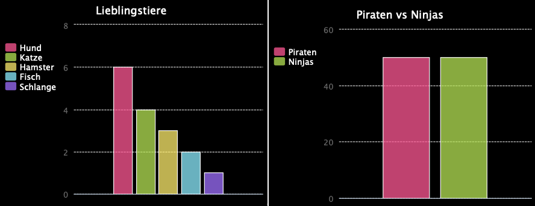

\--- challenge \---

## Daten von einer Datei ablesen

You can create bar charts in a similar way. Just use `barchart = pygal.Bar()` to create a new barchart, and then add data and render in the same way as for a pie chart.

Collect data from your Code Club members to create your own bar graph.

Make sure that you choose a topic that everyone will know about!

Hier sind ein paar Vorschläge:

+ What is your favourite sport?
+ What is your favourite ice cream flavour?
+ How do you get to school?
+ What month is your birthday?
+ Do you play Minecraft? (yes/no)

Don't ask questions that give personal data such as where people live. Ask your club leader if you're not sure.

Examples:

Und ergänze den CSS-Code in <0>style.css</0>, um das Bild zu positionieren.