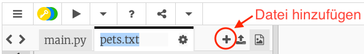
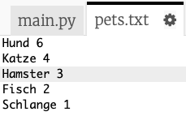
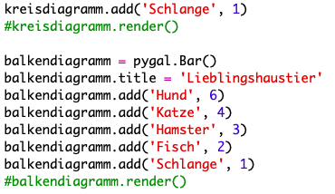
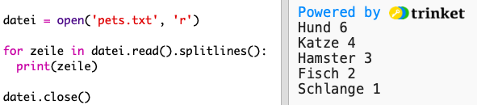
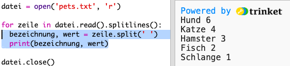
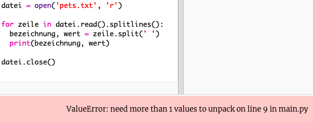
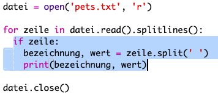
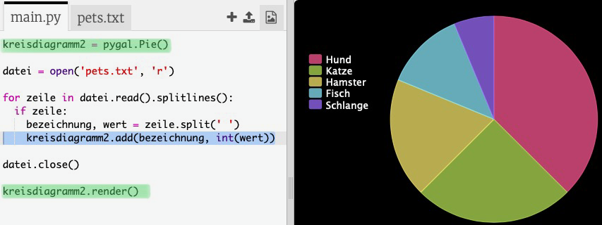

## Daten aus einer Datei auslesen

Es ist nützlich, Daten in einer Datei speichern zu können, anstatt sie in den Code aufnehmen zu müssen.

+ Füge deinem Projekt eine neue Datei hinzu und nenne sie `pets.txt`:
    
    

+ Fülle die Datei nun mit Daten. Du kannst die von dir gesammelten Lieblingshaustier-Daten oder die Beispieldaten verwenden.
    
    

+ Wechsle zurück zu `main.py` und kommentiere die Linien aus (damit sie nicht angezeigt werden), welche Diagramme und Grafiken rendern (anzeigen):
    
    

+ Lesen wir nun die Daten aus der Datei.
    
    
    
    Die `for` Schleife durchläuft die Zeilen in der Datei. `splitlines()` entfernt das Zeilenumbruchzeichen vom Zeilenende, da Du es nicht brauchst.

+ Jede Zeile muss in eine Bezeichnung und einen Wert aufgeteilt werden:
    
    
    
    Dies wird die Zeile an den Leerzeichen auftrennen. Füge also keine Leerzeichen in die Beschriftungen ein. (Du kannst die Unterstützung für Leerzeichen später hinzufügen.)

+ Möglicherweise erhältst Du eine Fehlermeldung wie diese:
    
    
    
    Dies passiert, wenn sich am Ende deiner Datei eine Leerzeile befindet.
    
    Du kannst den Fehler beheben, indem Du Bezeichnung und Wert nur abrufst, wenn die Zeile nicht leer ist.
    
    Um das zu tun, rücke den Code in der `for` Schleife ein und füge den Code `if line:` oberhalb hinzu:
    
    

+ Du kannst die Zeile `print(bezeichnung, wert)` entfernen, jetzt funktioniert alles.

+ Fügen wir nun die Bezeichnung und den Wert zu einem neuen Kreisdiagramm hinzu und rendern es:
    
    
    
    Beachte, dass `add` erwartet, dass der Wert eine Zahl ist. `int(wert)` wandelt den Wert einer Zeichenfolge (String) in eine Ganzzahl (Integer) um.
    
    Wenn Du Dezimalzahlen wie 3,5 (Gleitkommazahlen) verwenden möchtest, kannst Du stattdessen `float(wert)` verwenden.