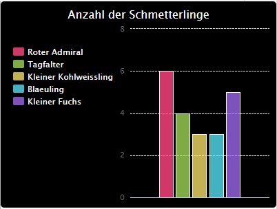

\--- challenge \---

## Herausforderung: Erstelle ein neues Diagramm aus einer Datei

Kannst Du aus Daten in einer Datei ein neues Balken- oder Kreisdiagramm erstellen? Du musst eine neue .txt-Datei erstellen.

Tipp: Wenn Du Leerzeichen in den Bezeichnungen haben möchtest, dann verwende `zeile.split(': ')` und füge Doppelpunkte hinzu. Beispiel: 'Roter Admiral: 6'

\--- /challenge \---