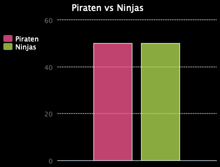
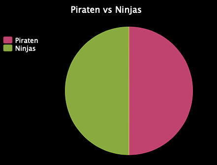

--- challenge ---

## Herausforderung: Mehr Diagramme und Grafiken!

Kannst Du aus derselben Datei ein Kreisdiagramm und ein Balkendiagramm erstellen? Du kannst entweder die zuvor gesammelten Daten verwenden oder einige neue Daten sammeln.

--- /challenge ---

***
Dieses Projekt wurde von freiwilligen Helfern übersetzt:

Julian Schweigert

Dennis Weber

Dank freiwilliger Helfer können wir Menschen auf der ganzen Welt die Möglichkeit geben, in ihrer eigenen Sprache zu lernen. Du kannst uns helfen, mehr Menschen zu erreichen, indem Du dich freiwillig zum Übersetzen meldest - weitere Informationen unter [rpf.io/translate](https://rpf.io/translate).