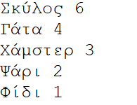
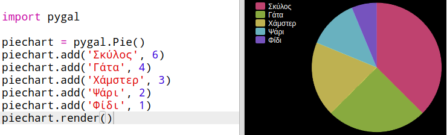
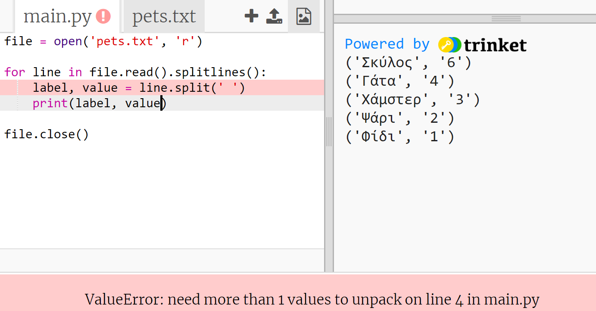
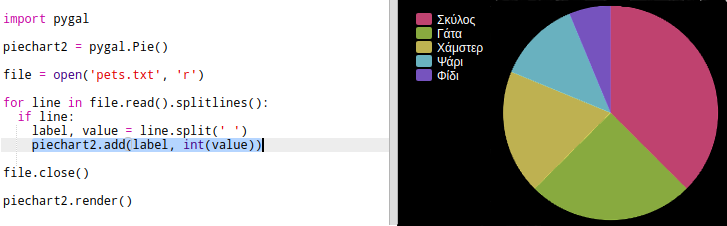
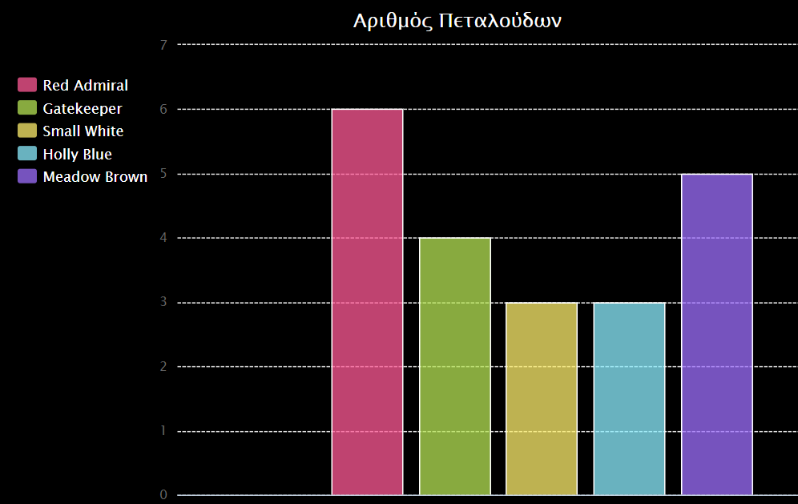

# Εισαγωγή {.intro}

Σε αυτό το έργο δημιουργείς διαγράμματα πίτας και ράβδων από δεδομένα που συλλέγεις από μέλη του Code Club σου.

  <iframe src="https://trinket.io/embed/python/70d24d92b8?outputOnly=true&start=result" width="600" height="500" frameborder="0" marginwidth="0" marginheight="0" allowfullscreen>
  </iframe>
  

# Βήμα 1: Δημιούργησε ένα διάγραμμα πίτας {.activity}

Τα διαγράμματα πίτας είναι χρήσιμος τρόπος για να οπτικοποιούμε δεδομένα. Ας κάνουμε μια έρευνα για τα αγαπημένα κατοικίδια ζώα στο Club Code σου και στη συνέχεια ας παρουσιάσουμε τα δεδομένα ως ένα διάγραμμα πίτας.

## Λίστα δραστηριοτήτων  {.check}

+ Ζήτησε από τον εθελοντή σου να σε βοηθήσει να οργανώσεις μια έρευνα. Θα μπορούσες να καταγράψεις τα αποτελέσματα σε έναν υπολογιστή συνδεδεμένο σε προβολέα ή σε πίνακα που όλοι μπορούν να δουν.
    
    Γράψε μια λίστα με κατοικίδια ζώα και βεβαιώσου ότι το αγαπημένο κατοικίδιο όλων συμπεριλαμβάνεται.
    
    Στη συνέχεια, κάλεσε όλους να ψηφίσουν το αγαπημένο τους, σηκώνοντας το χέρι τους όταν το ακούσουν. Μόνο μία ψηφοφορία για κάθε μαθητή επιτρέπεται!
    
    Για παράδειγμα:
    
    

+ Άνοιξε το κενό πρότυπο Python Trinket: <a href="http://jumpto.cc/python-new" target="_blank">jumpto.cc/python-new</a>.

+ Ας δημιουργήσουμε ένα διάγραμμα πίτας για να δεις τα αποτελέσματα της έρευνάς σου. Η βιβλιοθήκη PyGal θα σου λύσει τα χέρια.
    
    Πρώτα εισάγεις τη βιβλιοθήκη Pygal:
    
    

+ Τώρα ας δημιουργήσουμε ένα διάγραμμα πίτας και ας το απεικονίσουμε (εμφανίσουμε):
    
    
    
    Μην ανησυχείς, θα γίνει πιο ενδιαφέρον όταν θα προσθέσεις δεδομένα!

+ Ας προσθέσουμε τα δεδομένα για ένα από τα κατοικίδια ζώα. Χρησιμοποίησε τα δεδομένα που σύλλεξες.
    
    
    
    Αυτό είναι μόνο ένα μέρος των δεδομένων, οπότε προς το παρόν καταλαμβάνει ολόκληρο το διάγραμμα πίτας.

+ Τώρα πρόσθεσε τα υπόλοιπα δεδομένα με τον ίδιο τρόπο.
    
    Για παράδειγμα:
    
    

+ Και για να ολοκληρώσεις το γράφημά σου, πρόσθεσε έναν τίτλο:
    
    

## Αποθήκευσε το έργο σου {.save}

## Πρόκληση: Δημιούργησε το δικό σου διάγραμμα ράβδων {.challenge}

Μπορείς να δημιουργήσεις γραφήματα ράβδων με παρόμοιο τρόπο. Απλά χρησιμοποίησε το `barchart = pygal.Bar()` για να δημιουργήσεις ένα νέο διάγραμμα ράβδων, και στη συνέχεια πρόσθεσε δεδομένα και απεικόνισε με τον ίδιο τρόπο όπως ένα γράφημα πίτας.

Σύλλεξε δεδομένα από τα μέλη του Code Club για να δημιουργήσεις το δικό σου γράφημα.

Βεβαιώσου ότι έχεις επιλέξει ένα θέμα το οποίο όλοι θα γνωρίζουν!

Ακολουθούν μερικές ιδέες:

+ Ποιο είναι το αγαπημένο σου άθλημα;

+ Ποια είναι η αγαπημένη σου γεύση παγωτού;

+ Πώς πηγαίνεις στο σχολείο;

+ Ποιο μήνα είναι τα γενέθλιά σου;

+ Παίζεις Minecraft; (ναι/όχι)

Μην κάνεις ερωτήσεις που αφορούν προσωπικά δεδομένα, όπως που ζουν οι συμμαθητές σου. Μπορείς να συμβουλευτείς τον συντονιστή της ομάδας σου εάν δεν είσαι σίγουρος.

Παραδείγματα:

## Αποθήκευσε το έργο σου {.save}

# Βήμα 2: Ανάγνωση δεδομένων από ένα αρχείο {.activity}

Είναι χρήσιμο να μπορείς να αποθηκεύεις δεδομένα σε ένα αρχείο, αντί να χρειάζεται να τα συμπεριλαμβάνεις στον κώδικά σου.

## Λίστα δραστηριοτήτων  {.check}

+ Πρόσθεσε ένα νέο αρχείο στο έργο σου και ονόμασέ το `pets.txt`:
    
    

+ Τώρα πρόσθεσε δεδομένα στο αρχείο. Μπορείς να χρησιμοποιήσεις τα δεδομένα που σύλλεξες ή τα παραδείγματα δεδομένων που παρέχουμε εδώ.
    
    

+ Επέστρεψε στο `main.py` και απενεργοποίησε (βάζοντας # στην αρχή) τις γραμμές που εμφανίζουν γραφήματα (ώστε να μην γίνεται η απεικόνιση):
    
    

+ Τώρα ας διαβάσουμε τα δεδομένα από το αρχείο.
    
    
    
    Ο βρόχος `for` διαβάζει τις γραμμές του αρχείου μία προς μία. Η μέθοδος `splitlines()` αφαιρεί τον χαρακτήρα νέας γραμμής από το τέλος της κάθε γραμμής, επειδή αν παραμείνουν σε αυτό το έργο θα προκαλέσουν προβλήματα.

+ Κάθε γραμμή πρέπει να χωριστεί σε μια ετικέτα και μια τιμή:
    
    
    
    Αυτό θα διαιρέσει την κάθε γραμμή σε μικρότερα μέρη και η οριοθέτηση θα γίνει με τον κενό χαρακτήρα. Οπότε είναι σημαντικό να μην αφήνετε κενά στις ετικέτες. (Αργότερα θα μάθουμε τι μπορούμε να κάνουμε αν τελικά χρειαζόμαστε τα κενά.)

+ Ενδέχεται να εμφανιστεί ένα σφάλμα όπως αυτό:
    
    
    
    Αυτό συμβαίνει εάν έχεις μια κενή γραμμή στο τέλος του αρχείου σου.
    
    Μπορείς να διορθώσεις το σφάλμα, δηλώνοντας στον κώδικα να λάβει υπόψη του την ετικέτα και την τιμή μόνο εάν η γραμμή δεν είναι κενή.
    
    Για να γίνει αυτό, πρόσθεσε εσοχή στον κώδικα μέσα στο βρόχο `for` και γράψε τον κώδικα `if line:` από πάνω:
    
    

+ Μπορείς να αφαιρέσεις την γραμμή `print(label, value)` τώρα που όλα λειτουργούν σωστά.

+ Τώρα ας προσθέσουμε την ετικέτα και την τιμή σε ένα νέο διάγραμμα πίτας και ας το απεικονίσουμε:
    
    
    
    Παρατήρησε ότι το `add` θεωρεί ότι η τιμή θα είναι ένας αριθμός, η συνάρτηση `int(value)` μετατρέπει την τιμή από αλφαριθμητική σε ακέραιο.
    
    Εάν θέλεις να χρησιμοποιήσεις δεκαδικούς αριθμούς όπως 3.5, θα μπορούσες εναλλακτικά να χρησιμοποιήσεις τη συνάρτηση `float(value)`.

## Αποθήκευσε το έργο σου {.save}

## Πρόκληση: Δημιούργησε ένα νέο διάγραμμα από ένα αρχείο {.challenge}

Μπορείς να δημιουργήσεις ένα νέο γράφημα ράβδων ή διάγραμμα πίτας από τα δεδομένα ενός αρχείου; Θα χρειαστεί να δημιουργήσεις ένα νέο αρχείο .txt.

Συμβουλή: Εάν θέλεις να υπάρχουν κενά στις ετικέτες, χρησιμοποιείς το `line.split(': ')` και προσθέτεις άνω κάτω τέλεια στο αρχείο δεδομένων σου, π.χ. 'Red Admiral: 6'

## Αποθήκευσε το έργο σου {.save}

## Πρόκληση: Περισσότερα διαγράμματα! {.challenge}

Μπορείς να δημιουργήσεις ένα διάγραμμα πίτας και ένα γράφημα ράβδων από το ίδιο αρχείο; Μπορείς είτε να χρησιμοποιήσεις τα δεδομένα που σύλλεξες νωρίτερα είτε να συλλέξεις κάποια νέα δεδομένα.

## Αποθήκευσε το έργο σου {.save}