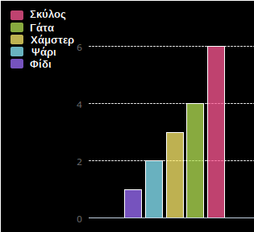

## Εισαγωγή

Σε αυτό το έργο δημιουργείς διαγράμματα πίτας και ράβδων από δεδομένα που συλλέγεις από μέλη του Code Club σου.

### Οδηγίες

Όταν κάνεις κλικ στο κουμπί Run, τα διαγράμματα δημιουργούνται από δεδομένα χρησιμοποιώντας τη βιβλιοθήκη PyGal.

  <iframe src="https://trinket.io/embed/python/70d24d92b8?outputOnly=true&start=result" width="600" height="500" frameborder="0" marginwidth="0" marginheight="0" allowfullscreen>
  </iframe>
  

### Τι θα μάθεις

Αυτό το έργο καλύπτει στοιχεία από τις ακόλουθες πτυχές του [Προγράμματος Μαθημάτων Ψηφιακής Δημιουργίας του Raspberry Pi](http://rpf.io/curriculum):

+ [Συνδύασε δομές προγραμματισμού για να λύσεις ένα πρόβλημα.](https://www.raspberrypi.org/curriculum/programming/builder/)

### Πρόσθετες πληροφορίες για εκπαιδευτικούς

Αν χρειαστεί να εκτυπώσεις αυτό το έργο, χρησιμοποίησε την [εκτυπώσιμη έκδοση](https://projects.raspberrypi.org/en/projects/popular-pets/print)"{:target="_blank"}.

Χρησιμοποίησε το σύνδεσμο στο υποσέλιδο για να αποκτήσεις πρόσβαση στο αποθετήριο GitHub για αυτό το έργο, το οποίο περιέχει όλους τους πόρους (συμπεριλαμβανομένου ενός έργου που έχει ολοκληρωθεί στο παράδειγμα) στο φάκελο 'en/resources'.