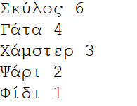
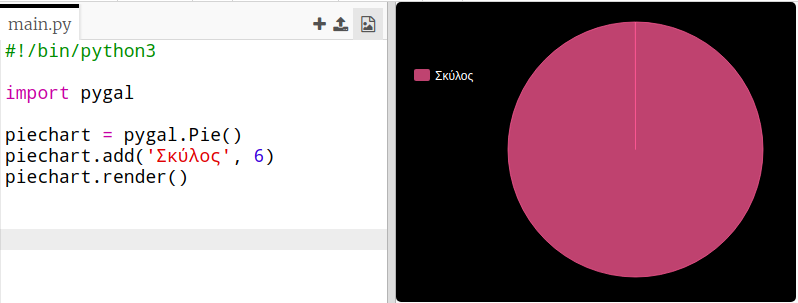
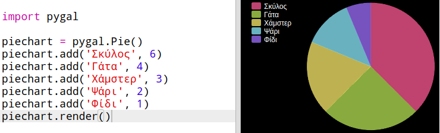
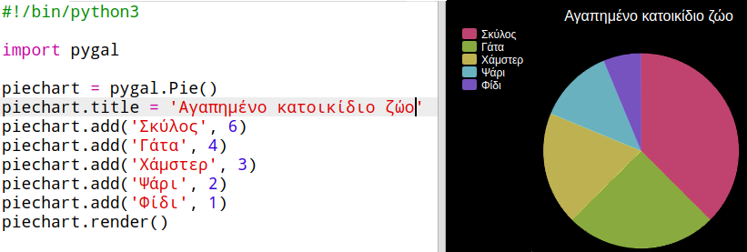

## Δημιούργησε ένα διάγραμμα πίτας

Pie Charts are useful way of showing data. Ας κάνουμε μια έρευνα για τα αγαπημένα κατοικίδια ζώα στο Code Club Code σου και στη συνέχεια ας παρουσιάσουμε τα δεδομένα ως ένα διάγραμμα πίτας.

+ Ζήτησε από το συντονιστή της ομάδας σου να σε βοηθήσεις να οργανώσεις μία έρευνα. Θα μπορούσες να καταγράψεις τα αποτελέσματα σε έναν υπολογιστή συνδεδεμένο σε προβολέα ή σε πίνακα που όλοι μπορούν να δουν.
    
    Γράψε μια λίστα με κατοικίδια ζώα και βεβαιώσου ότι το αγαπημένο κατοικίδιο όλων συμπεριλαμβάνεται.
    
    Στη συνέχεια, κάλεσε όλους να ψηφίσουν το αγαπημένο τους, σηκώνοντας το χέρι τους όταν το ακούσουν. Μόνο μία ψήφος επιτρέπεται για τον καθένα!
    
    Για παράδειγμα:
    
    

+ Άνοιξε το κενό πρότυπο Python Trinket: <a href="http://jumpto.cc/python-new" target="_blank">jumpto.cc/python-new</a>.

+ Ας δημιουργήσουμε ένα διάγραμμα πίτας για να δούμε τα αποτελέσματα της έρευνας σου. Η βιβλιοθήκη PyGal θα σου λύσει τα χέρια.
    
    Πρώτα εισάγεις τη βιβλιοθήκη Pygal:
    
    

+ Τώρα ας δημιουργήσουμε ένα διάγραμμα πίτας και ας το απεικονίσουμε (εμφανίσουμε):
    
    
    
    Μην ανησυχείς, θα γίνει πιο ενδιαφέρον όταν θα προσθέσεις δεδομένα!

+ Ας προσθέσουμε τα δεδομένα για ένα από τα κατοικίδια ζώα. Χρησιμοποίησε τα δεδομένα που σύλλεξες.
    
    
    
    Αυτό είναι μόνο ένα μέρος των δεδομένων, οπότε προς το παρόν καταλαμβάνει ολόκληρο το διάγραμμα πίτας.

+ Τώρα πρόσθεσε τα υπόλοιπα δεδομένα με τον ίδιο τρόπο.
    
    Για παράδειγμα:
    
    

+ Και για να ολοκληρώσεις το γράφημά σου, πρόσθεσε έναν τίτλο:
    
    