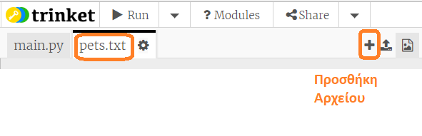

## Διάβασε δεδομένα από ένα αρχείο

Είναι χρήσιμο να μπορείς να αποθηκεύεις δεδομένα σε ένα αρχείο, αντί να χρειάζεται να τα συμπεριλαμβάνεις στον κώδικά σου.

+ Πρόσθεσε ένα νέο αρχείο στο έργο σου και ονόμασέ το `pets.txt`:
    
    

+ Τώρα πρόσθεσε δεδομένα στο αρχείο. Μπορείς να χρησιμοποιήσεις τα δεδομένα που συνέλεξες ή τα παραδείγματα δεδομένων που παρέχουμε εδώ.
    
    

+ Επέστρεψε στο `main.py` και απενεργοποίησε (βάζοντας # στην αρχή) τις γραμμές που εμφανίζουν γραφήματα (ώστε να μην γίνεται η απεικόνιση):
    
    

+ Τώρα ας διαβάσουμε τα δεδομένα από το αρχείο.
    
    
    
    Ο βρόχος `for` θα περάσει τις γραμμές του αρχείου μία προς μία. Η εντολή `splitlines()` καταργεί τον χαρακτήρα νέας γραμμής από το τέλος της κάθε γραμμής, καθώς είναι κάτι που θα δημιουργούσε πρόβλημα και δεν το θέλουμε.

+ Κάθε γραμμή πρέπει να χωριστεί σε μια ετικέτα και μια τιμή:
    
    
    
    Αυτό θα διαιρέσει τη γραμμή σε μέρη που οριοθετούνται από κενά οπότε να μη βάζεις κενά στις ετικέτες. (θα μάθεις αργότερα πώς μπορείς να βάλεις κενά στις ετικέτες.)

+ Ενδέχεται να εμφανιστεί ένα σφάλμα όπως αυτό:
    
    
    
    Αυτό συμβαίνει εάν έχεις μια κενή γραμμή στο τέλος του αρχείου σου.
    
    Μπορείς να διορθώσεις το σφάλμα, δηλώνοντας στον κώδικα να λάβει υπόψη του την ετικέτα και την τιμή μόνο εάν η γραμμή δεν είναι κενή.
    
    Για να γίνει αυτό, πρόσθεσε εσοχή στον κώδικα μέσα στο βρόχο `for` και γράψε τον κώδικα `if line:` από πάνω:
    
    

+ Μπορείς να αφαιρέσεις την γραμμή `print(label, value)` τώρα που όλα λειτουργούν σωστά.

+ Τώρα ας προσθέσουμε την ετικέτα και την τιμή σε ένα νέο διάγραμμα πίτας και ας το απεικονίσουμε:
    
    
    
    Παρατήρησε ότι το `add` θεωρεί ότι η τιμή θα είναι ένας αριθμός, η συνάρτηση `int(value)` μετατρέπει την τιμή από αλφαριθμητική σε ακέραια.
    
    Εάν θέλεις να χρησιμοποιήσεις δεκαδικούς αριθμούς όπως 3.5, θα μπορούσες εναλλακτικά να χρησιμοποιήσεις τη συνάρτηση `float(value)`.