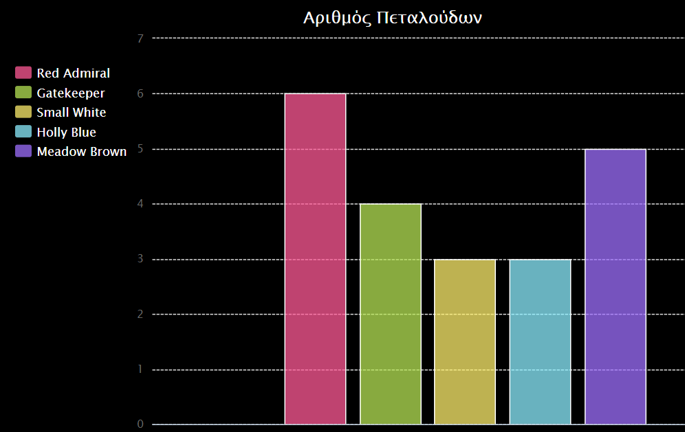

--- challenge ---

## Πρόκληση: Δημιούργησε ένα νέο διάγραμμα από ένα αρχείο

Μπορείς να δημιουργήσεις ένα νέο γράφημα ράβδων ή διάγραμμα πίτας από τα δεδομένα ενός αρχείου; Θα χρειαστεί να δημιουργήσεις ένα νέο αρχείο .txt.

Συμβουλή: Εάν θέλεις να υπάρχουν κενά στις ετικέτες, χρησιμοποιείς το `line.split(': ')` και προσθέτεις άνω κάτω τέλεια στο αρχείο δεδομένων σου, π.χ. 'Red Admiral: 6'

--- /challenge ---