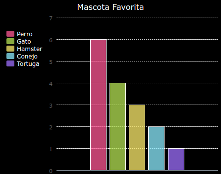
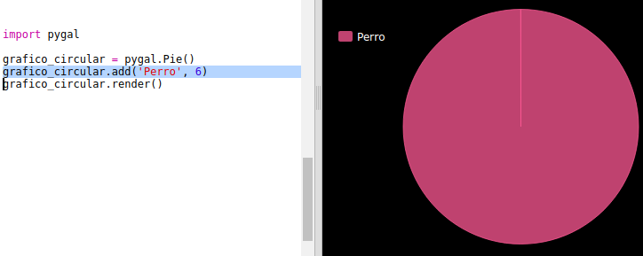
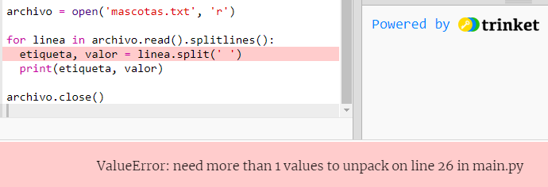
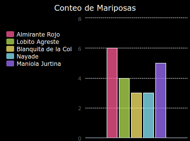

# Introducción {.intro}

En este proyecto, crearás gráficos circulares y gráficos de barras a partir de datos que recaudes de los miembros de tu Code Club.

  <iframe src="https://trinket.io/embed/python/70d24d92b8?outputOnly=true&start=result" width="600" height="500" frameborder="0" marginwidth="0" marginheight="0" allowfullscreen>
  </iframe>
  

# Paso 1: Crear un gráfico circular {.activity}

Los gráficos circulares son un modo muy útil de mostrar datos. Realicemos una encuesta sobre las mascotas favoritas en tu Code Club y mostremos los datos como un gráfico circular.

## Lista de Actividades {.check}

+ Solicita a un voluntario que te ayude a organizar la encuesta. Puedes registrar los resultados en un ordenador conectado a un proyector o en una pizarra para que todos puedan verlos.
    
    Escribe una lista de mascotas y asegúrate de que todos hayan incluido su favorita.
    
    Pide a todos que voten por su mascota favorita levantando la mano cuando digas su nombre en alto. ¡Una persona, un voto!
    
    Por ejemplo:
    
    

+ Abre la plantilla en blanco de Python en Trinket: <a href="http://jumpto.cc/python-new" target="_blank">jumpto.cc/python-new</a>.

+ Vamos a crear un gráfico circular para mostrar los resultados de la encuesta. Estarás usando la librería PyGal para hacer parte del trabajo duro.
    
    En primer lugar, importa la librería PyGal:
    
    

+ A continuación, crea un gráfico circular y reprodúcelo (visualízalo):
    
    
    
    No te preocupes, ¡se volverá más interesante cuando agregues datos!

+ Agreguemos los datos de una de las mascotas. Usa los datos que has recaudado.
    
    
    
    En estos momentos solamente hay datos de una mascota, el cual abarca todo el gráfico circular.

+ A continuación, agrega el resto de datos del mismo modo.
    
    Por ejemplo:
    
    

+ Para finalizar el gráfico, añade un título:
    
    

## Guarda tu proyecto {.save}

## Reto: Crea tu propio gráfico de barras {.challenge}

Puedes crear gráficos de barras de modo similar. Simplemente usa `grafico_barras = pygal.Bar()` para crear un nuevo gráfico de barras, luego agrega datos y reprodúcelo del mismo modo que hiciste con el gráfico circular.

Recauda datos de los miembros de tu Code Club para crear tu propio gráfico de barras.

¡Asegúrate de escoger un tema del que todos puedan opinar!

Aquí tienes algunas sugerencias:

+ ¿Cuál es su deporte favorito?

+ ¿Cuál es su sabor de helado favorito?

+ ¿Cómo vas al colegio?

+ ¿En qué mes cae tu cumpleaños?

+ ¿Juegas Minecraft? (sí/no)

No hagas preguntas que proporcionen datos personales tales como la dirección de donde vives. Si no estás seguro, pregunta al líder de tu club.

Ejemplos:

## Guarda tu proyecto {.save}

# Paso 2: Lee los datos desde un archivo {.activity}

Resulta muy útil ser capaz de almacenar datos en un archivo en lugar de tener que incluirlos en tu código.

## Lista de Actividades {.check}

+ Agrega un nuevo archivo a tu proyecto y llámalo `mascotas.txt`:
    
    

+ A continuación, agrega datos al archivo. Puedes usar los datos de las mascotas favoritas que recaudaste o los datos de ejemplo.
    
    

+ Regresa a `main.py` y comenta las líneas que reprodúcen (visualizan) cuadros y gráficos (de tal modo que no sean visualizados):
    
    

+ A continuación, lee los datos del archivo.
    
    
    
    El bucle `for` recorrerá a través de las líneas del archivo. `splitlines()` elimina el carácter de línea nueva del final de la línea, ya que no lo necesitas.

+ Cada línea debe separarse en una etiqueta y un valor:
    
    
    
    Esto separará la línea en los espacios, por lo tanto, no incluyas espacios en las etiquetas. (Puedes añadir soporte para los espacios en las etiquetas más adelante).

+ Es posible que obtengas un error como este:
    
    
    
    Esto sucederá si tienes una línea vacía al final de tu archivo.
    
    Puedes solucionar el error tomando solamente la etiqueta y el valor si la línea no está vacía.
    
    Para ello, indenta el código dentro del bucle `for` y añade el código `if line:` encima:
    
    

+ Puedes eliminar la línea `print(etiqueta, valor)` ahora que todo funciona correctamente.

+ Ahora, agreguemos la etiqueta y el valor a un nuevo Gráfico Circular y reproduzcámoslo:
    
    
    
    Ten en cuenta que `add` espera que el valor sea un número, `int(valor)` convierte el valor de texto a un número entero.
    
    Si deseas usar decimales como 3.5 (números de coma flotante), puedes usar `float(valor)` en su lugar.

## Guarda tu Proyecto {.save}

## Reto: Crea un nuevo gráfico a partir de un archivo {.challenge}

¿Puedes crear un nuevo gráfico circular o gráfico de barras a partir de los datos en un archivo? Necesitarás crear un nuevo archivo .txt.

Sugerencia: Si quieres tener espacios en las etiquetas, usa `line.split(': ')` y agrega dos puntos a tu archivo de datos, p. ej., ‘Almirante Rojo: 6’

## Guarda tu Proyecto {.save}

## Reto: ¡Más cuadros y gráficos! {.challenge}

¿Puedes crear un gráfico circular y un gráfico de barras a partir del mismo archivo? Puedes usar los datos que recaudaste anteriormente o recaudar datos nuevos.

## Guarda tu Proyecto {.save}