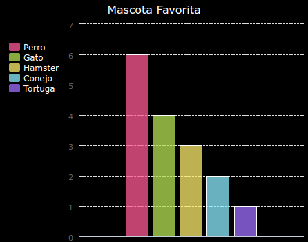

## Introducción

In this project you create pie charts and bar graphs from data that you collect from members of your Code Club.

### Instrucciones

When you click Run the charts are generated from data using the PyGal python module.

  <iframe src="https://trinket.io/embed/python/70d24d92b8?outputOnly=true&start=result" width="600" height="500" frameborder="0" marginwidth="0" marginheight="0" allowfullscreen>
  </iframe>
  

### Lo que aprenderás

Este proyecto incluye elementos de los siguientes aspectos del [currículo de creación digital de Raspberry Pi](http://rpf.io/curriculum):

+ [Combina estructuras de programación para resolver un problema.](https://www.raspberrypi.org/curriculum/programming/builder/)

### Información adicional para los educadores

Si necesitas imprimir este proyecto, usa la [versión para imprimir](https://projects.raspberrypi.org/en/projects/popular-pets/print){:target="_blank"}.

Usa el enlace en el pie de página para acceder al repositorio de GitHub para este proyecto, que contiene todos los recursos (incluyendo un ejemplo de un proyecto terminado) en la carpeta 'en/resources'.