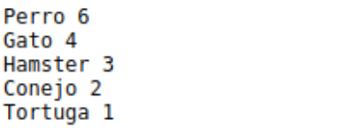
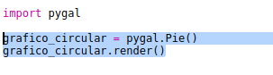
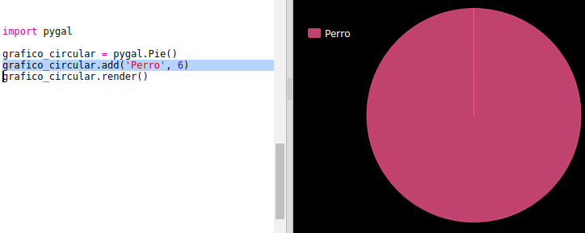
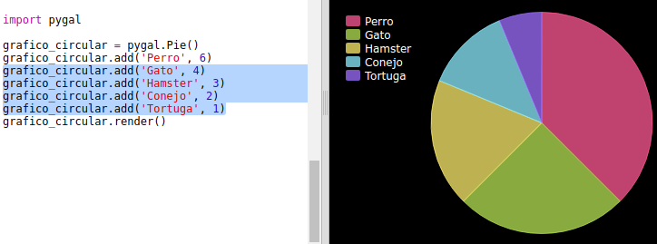
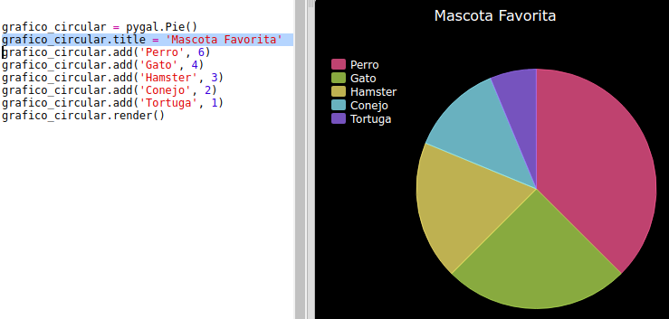

## Crea un gráfico de sectores

Los gráficos de sectores son un modo muy útil de mostrar datos. Realicemos una encuesta sobre las mascotas favoritas en tu Code Club y, a continuación, mostremos los datos como un gráfico de sectores. 

+ Solicita a un voluntario que te ayude a organizar tu encuesta. Puedes registrar los resultados en un ordenador conectado a un proyector o en una pizarra para que todos puedan verlos. 

  Escribe una lista de mascotas y asegúrate de que todos hayan incluido sus favoritas. 
  
  Pide a todos que voten sus mascotas favoritas levantando la mano cuando digas su nombre en alto. ¡Una persona, un voto!
  
  Por ejemplo:
  
  

+ Abre el Trinket de la plantilla en blanco de Python: <a href="http://jumpto.cc/python-new" target="_blank">jumpto.cc/python-new</a>. 

+ Creemos un gráfico de sectores que muestre los resultados de tu encuesta. Para el trabajo más duro, usarás la biblioteca PyGal.

  En primer lugar, importa la biblioteca PyGal:

  

+ A continuación, crea un cuadro de sectores y represéntalo (visualízalo):

  
  
  No te preocupes, ¡se vuelve más interesante cuando añades datos!

+ Añadamos los datos de una de las mascotas. Usa los datos que has obtenido.

  
  
  En estos momentos solamente hay un dato, el cual abarca todo el gráfico de sectores. 

+ A continuación, añade el resto de datos del mismo modo. 

  Por ejemplo:
  
  
  
+ Para acabar el gráfico, añade un título:

  
