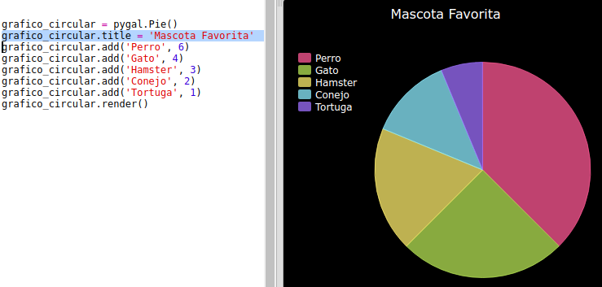

## Reto: Crea tu propio gráfico de barras

Los gráficos circulares son una forma útil de mostrar datos. Realicemos una encuesta sobre las mascotas favoritas en tu Code Club y mostremos los datos como un gráfico circular.

+ Solicita al líder de tu club que te ayude a organizar la encuesta. Puedes registrar los resultados en un ordenador conectado a un proyector o en una pizarra para que todos puedan verlos.
    
    Escribe una lista de mascotas y asegúrate de que todos hayan incluido su favorita.
    
    Pide a todos que voten por su mascota favorita levantando la mano cuando digas su nombre en alto. ¡Una persona, un voto!
    
    Por ejemplo:
    
    

+ Abre la plantilla en blanco de Python en Trinket: <a href="http://jumpto.cc/python-new" target="_blank">jumpto.cc/python-new</a>.

+ Vamos a crear un gráfico circular para mostrar los resultados de la encuesta. Estarás usando la biblioteca de PyGal para hacer parte del trabajo duro.
    
    En primer lugar, importa la biblioteca PyGal:
    
    

+ A continuación, crea un gráficos circulares y reprodúcelo (visualízalo):
    
    
    
    No te preocupes, ¡se volverá más interesante cuando agregues datos!

+ Agreguemos los datos de una de las mascotas. Usa los datos que has recaudado.
    
    
    
    En estos momentos solamente hay datos de una mascota, el cual abarca todo el gráfico circular.

+ A continuación, agreguemos el resto de datos del mismo modo.
    
    Por ejemplo:
    
    

+ Para finalizar el gráfico, añade un título:
    
    