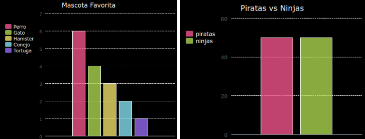

--- challenge ---
## Reto: Crea tu propio gráfico de barras 

Podrás crear gráficos de barras de modo similar. Simplemente usa `barchart = pygal.Bar()` para crear un nuevo gráfico de barras y, a continuación, añade gráficos y preséntalos del mismo modo que hiciste con el gráfico de sectores. 

Recauda datos de los miembros de tu Code Club para crear tu propio gráfico de barras.

¡Asegúrate de que seleccionas un tópico del que todos puedan opinar!

Aquí te proporcionamos algunas ideas:

+ ¿Cuál es tu deporte favorito?
+ ¿Cuál es tu helado favorito?
+ ¿Cómo vas al colegio?
+ ¿En qué mes cae tu cumpleaños?
+ ¿Juegas a Minecraft? (sí/no)

No hagas preguntas que proporcionen datos personales tales como la dirección. Si no estás seguro, consulta con el jefe de tu club. 

Ejemplos:

--- /challenge ---

