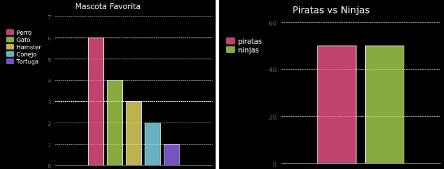

\--- challenge \---

## Lee los datos desde un archivo

Puedes crear gráficos de barras de modo similar. Simplemente usa `barchart = pygal.Bar()` para crear un nuevo gráfico de barras, luego agrega datos y reprodúcelo del mismo modo que hiciste con el gráfico circular.

Recauda datos de los miembros de tu Code Club para crear tu propio gráfico de barras.

¡Asegúrate de escoger un tópico del que todos puedan opinar!

Aquí tienes algunas sugerencias:

+ ¿Cuál es su deporte favorito?
+ ¿Cuál es su sabor de helado favorito?
+ ¿Cómo vas al colegio?
+ ¿En qué mes cae tu cumpleaños?
+ ¿Juegas Minecraft? (sí/no)

No hagas preguntas que proporcionen datos personales tales como la dirección de donde vives. Si no estás seguro, pregunta al líder de tu club.

Ejemplos:

\--- /challenge \---