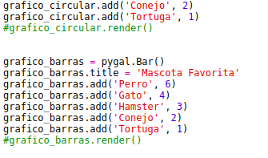
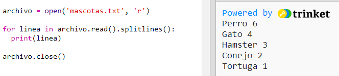
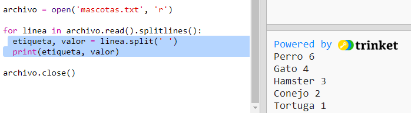
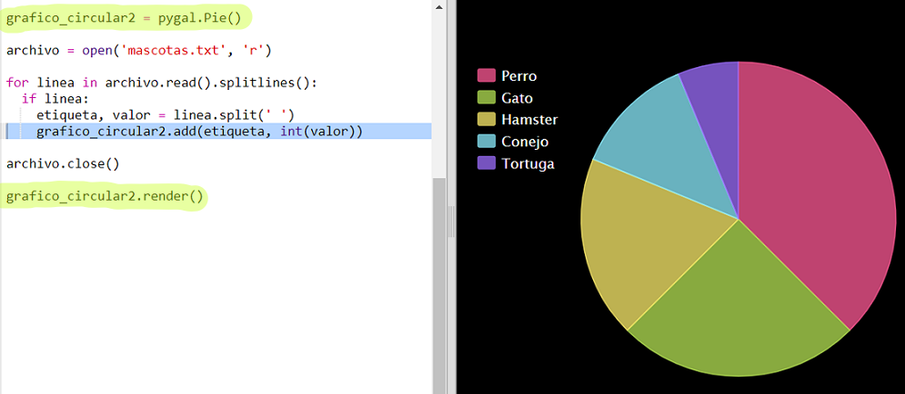

## Lee los datos desde un archivo

Resulta muy útil almacenar datos en un archivo en lugar de tener que incluirlos en tu código. 

+ Añade un nuevo archivo a tu proyecto y llámalo `pets.txt`:

  

+ A continuación, añade los datos al archivo. Puedes usar los datos de las mascotas favoritas que recaudaste o los datos de ejemplo.

  
  
+ Regresa a `main.py` y comenta las líneas que representan (visualizan) cuadros y gráficos (de tal modo que no sean visualizados):

  

+ A continuación, lee los datos del archivo. 

  
  
  El bucle 'for' ciclará por las líneas del archivo. `splitlines()` elimina el carácter de la nueva línea del final de la línea. 
  
+ Cada línea debe separarse en una etiqueta y valor:
  
  
  
  Con ello dividirás la línea en los espacios, por lo tanto, no incluyas espacios en las etiquetas. (Puedes añadir soporte para los espacios en las etiquetas más adelante).
  
+ Es posible que recibas un error del siguiente tipo:

  
  
  Esto sucederá si tienes una línea vacía al final de tu archivo. 
  
  Solamente podrás solucionar el error usando la etiqueta y el valor si la línea no está vacía.

  Para ello, sangra el código dentro del bucle `for` y añade el código `if line:` encima:
  
  
  
+ Ahora que todo funciona correctamente, puedes eliminar la línea `print(label, value)`. 
  
+ A continuación, añadamos la etiqueta y el valor a un nuevo gráfico de sectores y representémoslo:

  
  
  Ten en cuenta que `add` espera que el valor sea un número. `int(value)` convierte el valor de una cadena a un número entero.
  
  Si deseas usar decimales como 3,5 (números de coma flotante), puedes usar `float(value)`. 
  
