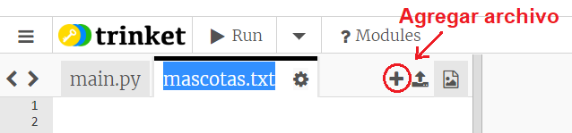
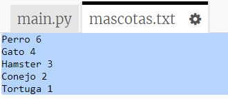
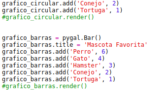
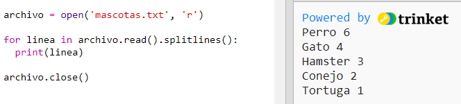
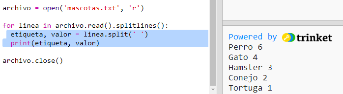
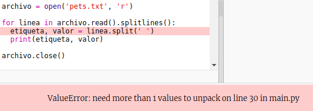
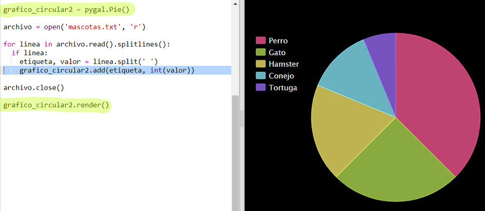

## Reto: Crea un nuevo gráfico a partir de un archivo

It's useful to be able to store data in a file rather than having to include it in your code.

+ Add a new file to your project and call it `pets.txt`:
    
    

+ Now add data to the file. You can use the favourite pets data that you collected or the example data.
    
    

+ Switch back to `main.py` and comment out the lines that render (display) charts and graphs (so that they aren't displayed):
    
    

+ Now let's read the data from the file.
    
    
    
    The `for` loop will loop over the lines in the file. `splitlines()` removes the newline character from the end of the line as you don't want that.

+ Each line needs to be separated into a label and a value:
    
    
    
    This will split the line at the spaces so don't include spaces in the labels. (You can add support for spaces in labels later.)

+ You might get an error like this:
    
    
    
    This happens if you have an empty line at the end of your file.
    
    You can fix the error by only getting the label and value if the line isn't empty.
    
    To do this, indent the code inside your `for` loop and add the code `if line:` above it:
    
    

+ You can remove the `print(label, value)` line now everything is working.

+ Now let's add the label and value to a new Pie Chart and render it:
    
    
    
    Note that `add` expects the value to be a number, `int(value)` turns the value from a string into an integer.
    
    If you wanted to use decimals such as 3.5 (floating point numbers) you could use `float(value)` instead.