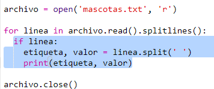

## Lee los datos desde un archivo

Resulta muy útil ser capaz de almacenar datos en un archivo en lugar de tener que incluirlos en tu código.

+ Agrega un nuevo archivo a tu proyecto y llámalo `mascotas.txt`:
    
    

+ A continuación, agrega datos al archivo. Puedes usar los datos de las mascotas favoritas que recaudaste o los datos de ejemplo.
    
    

+ Regresa a `main.py` y comenta las líneas que reprodúcen (visualizan) cuadros y gráficos (de tal modo que no sean visualizados):
    
    

+ A continuación, lee los datos del archivo.
    
    
    
    El bucle `for` recorrerá a traves de las líneas del archivo. `splitlines()` elimina el caracter de línea nueva del final de la línea, ya que no lo necesitas.

+ Cada línea debe separarse en una etiqueta y un valor:
    
    
    
    Esto separará la línea en los espacios, por lo tanto, no incluyas espacios en las etiquetas. (Puedes añadir soporte para los espacios en las etiquetas más adelante).

+ Es posible que obtengas un error como este:
    
    
    
    Esto sucederá si tienes una línea vacía al final de tu archivo.
    
    Puedes solucionar el error tomando solamente la etiqueta y el valor si la línea no está vacía.
    
    Para ello, indenta el código dentro del bucle `for` y añade el código `if line:` encima:
    
    

+ Ahora que todo funciona correctamente, puedes eliminar la línea `print(label, value)`.

+ Ahora, agreguemos la etiqueta y el valor a un nuevo Gráfico Circular y reproduzcámoslo:
    
    
    
    Ten en cuenta que `add` espera que el valor sea un número, `int(value)` convierte el valor de texto a un número entero.
    
    Si deseas usar decimales como 3.5 (números de coma flotante), puedes usar `float(value)` en su lugar.