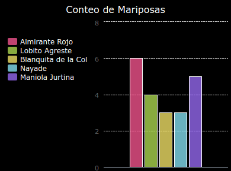

--- challenge ---

## Desafío: Crea un nuevo gráfico a partir de un archivo

¿Puedes crear un nuevo gráfico circular o gráfico de barras a partir de los datos en un archivo? Necesitarás crear un nuevo archivo .txt.

Sugerencia: Si quieres tener espacios en las etiquetas, usa `linea.split(': ')` y agrega dos puntos a tu archivo de datos, p. ej., ‘Almirante Rojo: 6’

--- /challenge ---