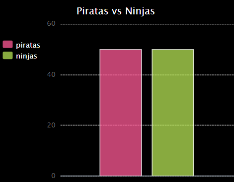
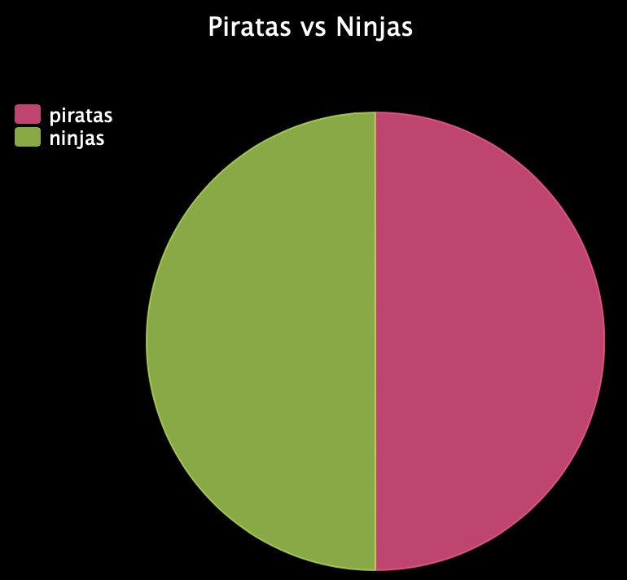

--- challenge ---

## Reto: ¡Más cuadros y gráficos!

¿Puedes crear un gráfico circular y un gráfico de barras a partir del mismo archivo? Puedes usar los datos que recolectaste anteriormente o recolectar datos nuevos.

--- /challenge ---

***
Este proyecto fue traducido por voluntarios:

Enrique Vigo

Carlos Miguel Yalta Vargas

Gracias a los voluntarios, podemos dar a las personas de todo el mundo la oportunidad de aprender en su propio idioma. Puedes ayudarnos a llegar a más personas ofreciéndote como voluntario para traducir. Más información en [rpf.io/translate](https://rpf.io/translate).