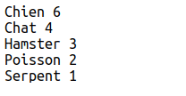
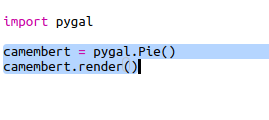
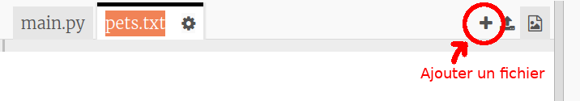
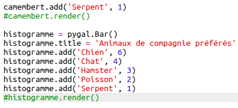
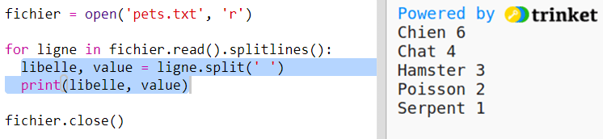

# Introduction {.intro}

Dans ce projet, tu créeras des camemberts et des histogrammes à partir de données que tu collectes auprès des membres de ton Code Club.

  <iframe src="https://trinket.io/embed/python/70d24d92b8?outputOnly=true&start=result" width="600" height="500" frameborder="0" marginwidth="0" marginheight="0" allowfullscreen>
  </iframe>
  

# Étape 1: Créer un camembert {.activity}

Les camemberts sont un moyen utile d’afficher des données. Faisons une enquête sur les animaux de compagnie préférés dans ton Code Club, puis présentons les données sous forme de Camemberts.

## Liste de contrôle d'activité {.check}

+ Demande à ton volontaire de t'aider à organiser une enquête. Tu pouvez enregistrer les résultats sur un ordinateur connecté à un projecteur ou à un tableau blanc visible par tout le monde.
    
    Rédige une liste d'animaux de compagnie et assures-toi que les animaux de compagnie préférés de tout le monde sont inclus.
    
    Demande ensuite à chacun de voter pour son favori en levant la main au moment de l'appel. Un seul vote chacun !
    
    Par exemple :
    
    

+ Ouvre le modèle de Trinket Python vierge : <a href="http://jumpto.cc/python-new" target="_blank">jumpto.cc/python-new</a>.

+ Créons un camembert montrant les résultats de ton enquête. Tu utiliseras la bibliothèque PyGal pour effectuer une partie de ce travail compliqué.
    
    Commence par importer la bibliothèque Pygal :
    
    

+ Créons maintenant un Camembert et affichons-le :
    
    
    
    Ne t'inquiètes pas, cela devient plus intéressant lorsque tu ajoutes des données!

+ Ajoutons les données pour l'un des animaux de compagnie. Utilise les données que tu as collectées.
    
    
    
    Il n’y a qu’une donnée, elle occupe donc tout le camembert.

+ Ajoutez maintenant le reste des données de la même manière.
    
    Par exemple :
    
    

+ Et pour finir ton graphique, ajoute un titre :
    
    

## Enregistre ton projet {.save}

## Défi : Crée ton histogramme {.challenge}

Tu peux créer des histogrammes de la même manière. Il te suffit d'utiliser `histogramme = pygal.Bar()` pour créer un nouvel histogramme, puis ajoute des données et effectue l'affichage de la même manière que pour un camembert.

Recueille des données auprès de tes membres du Code Club pour créer ton histogramme.

Assures-toi de choisir un sujet avec lequel tout le monde est familier !

Voici quelques idées:

+ Quel est ton sport favori ?

+ Quel est ton parfum de glace préféré ?

+ Comment vas-tu à l'école ?

+ Quel est le mois de ton anniversaire ?

+ Joues-tu à Minecraft ? (Oui/Non)

Ne pose pas de questions donnant des données personnelles telles que le lieu de résidence des participants. Demande à ton responsable de club si tu n'est pas sûr.

Exemples :

## Enregistre ton projet {.save}

# Étape 2: Lire les données d'un fichier {.activity}

Il est utile de pouvoir stocker des données dans un fichier plutôt que de les inclure dans ton code.

## Liste de contrôle d'activité {.check}

+ Ajoute un nouveau fichier à ton projet et appelle-le `pets.txt`:
    
    

+ Ajoute maintenant des données au fichier. Tu peux utiliser les données des animaux de compagnie que tu as collectées ou les exemples de données.
    
    

+ Reviens à `main.py` et commente les lignes qui affichent les graphiques (de sorte qu'ils ne sont pas affichés) :
    
    

+ Lisons maintenant les données du fichier.
    
    
    
    La boucle `for` passera en boucle sur toutes les lignes du fichier. `splitlines ()` supprime le caractère de retour à la ligne de la fin de ligne car tu ne souhaites pas les conserver.

+ Chaque ligne doit être séparée en un libellé et une valeur:
    
    
    
    Cela divisera la ligne au niveau des espaces, alors n'inclue pas d'espaces dans les libellés. (Tu peux ajouter ultérieurement une prise en charge des espaces dans les libellés.)

+ Tu pourrais avoir une erreur comme celle-ci :
    
    
    
    Cela se produit si tu as une ligne vide à la fin de ton fichier.
    
    Tu peuxz corriger l'erreur en récupérant uniquement le libellé et la valeur si la ligne n'est pas vide.
    
    Pour ce faire, indentez le code dans votre boucle `for` et ajoutez le code `if line:` juste avant:
    
    

+ Vous pouvez supprimer la ligne `print(label, value)` maintenant que tout fonctionne.

+ Ajoutons maintenant le libellé et la valeur à un nouveau camembert et affichons-le:
    
    
    
    Notez que `add` suppose que la valeur est un nombre, `int (value)` transforme la valeur d'une chaîne en un entier.
    
    Si vous souhaitez utiliser des nombres décimaux tels que 3.5 (nombres à virgule flottante), vous pouvez utiliser `float (value)` à la place.

## Enregistrez votre projet {.save}

## Défi : Créez un histogramme ou un camembert à partir d'un fichier {.challenge}

Pouvez-vous créer un nouvel histogramme ou un camembert à partir des données d'un fichier? Vous devrez créer un nouveau fichier .txt.

Astuce: Si vous voulez avoir des espaces dans les libellés, utilisez `line.split (':')` et ajoutez deux points pour les séparer dans votre fichier de données, par exemple 'Red Admiral: 6'

## Enregistrez votre projet {.save}

## Défi: Plus de tableaux et de graphiques! {.challenge}

Pouvez-vous créer un camembert ou un histogramme à partir du même fichier? Vous pouvez utiliser les données que vous avez collectées précédemment ou collecter de nouvelles données.

## Enregistrez votre projet {.save}