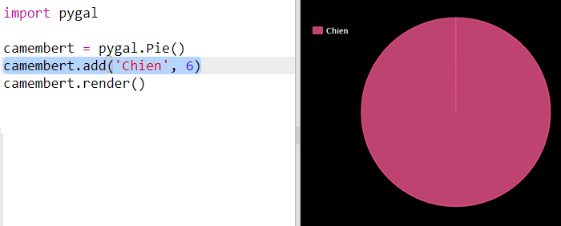
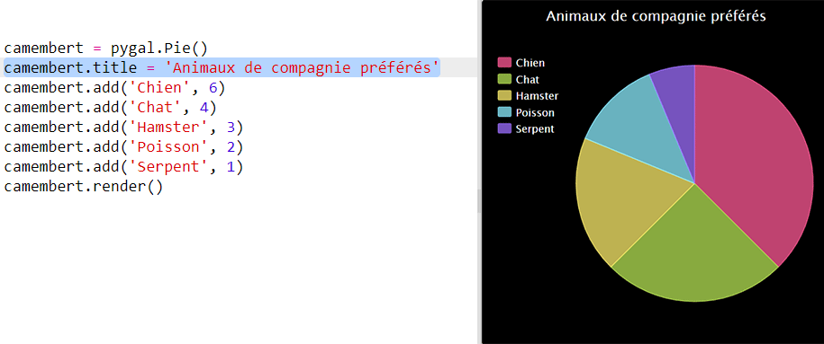

# Introduction {.intro}

Dans ce projet, vous créez des camemberts et des histogrammes à partir de données que vous collectez auprès des membres de votre Code Club.

  <iframe src="https://trinket.io/embed/python/70d24d92b8?outputOnly=true&start=result" width="600" height="500" frameborder="0" marginwidth="0" marginheight="0" allowfullscreen>
  </iframe>
  

# Étape 1: Créer un camembert {.activity}

Les camemberts sont un moyen utile d’afficher des données. Faisons une enquête sur les animaux de compagnie préférés dans votre Code Club, puis présentons les données sous forme de Camemberts.

## Liste de contrôle d'activité {.check}

+ Demandez à votre volontaire de vous aider à organiser une enquête. Vous pouvez enregistrer les résultats sur un ordinateur connecté à un projecteur ou à un tableau blanc visible par tout le monde.
    
    Rédigez une liste d'animaux de compagnie et assurez-vous que tous les animaux préférés sont inclus.
    
    Demandez ensuite à chacun de voter pour son favori en levant la main au moment de l'appel. Un seul vote chacun!
    
    Par exemple :
    
    

+ Ouvre le modèle de Trinket Python vierge : <a href="http://jumpto.cc/python-new" target="_blank">jumpto.cc/python-new</a>.

+ Créons un graphique à secteurs montrant les résultats de votre enquête. Vous utiliserez la bibliothèque PyGal pour effectuer une partie du travail difficile.
    
    Commencez par importer la bibliothèque Pygal:
    
    

+ Créons maintenant un diagramme à secteurs et rendons-le (affiché):
    
    
    
    Ne vous inquiétez pas, cela devient plus intéressant lorsque vous ajoutez des données!

+ Ajoutons les données pour l'un des animaux de compagnie. Utilisez les données que vous avez collectées.
    
    
    
    Il n’ya qu’une donnée, elle occupe donc tout le graphique à secteurs.

+ Ajoutez maintenant le reste des données de la même manière.
    
    Par exemple :
    
    

+ Et pour finir votre graphique, ajoutez un titre:
    
    

## Enregistrez votre projet {.save}

## Lire des données à partir d'un fichier {.challenge}

Vous pouvez créer des graphiques à barres de la même manière. Il vous suffit d'utiliser `diagramme à barres = pygal.Bar ()` pour créer un nouveau diagramme à barres, puis à ajouter des données et à effectuer le rendu de la même manière que pour un graphique à secteurs.

Recueillez des données auprès de vos membres du Code Club pour créer votre propre graphique à barres.

Assurez-vous de choisir un sujet que tout le monde connaîtra!

Voici quelques idées:

+ Quel est votre sport favori?

+ Quelle est votre saveur de glace préférée?

+ Comment allez-vous à l'école?

+ Quel mois est votre anniversaire?

+ Jouez-vous à Minecraft? (Oui Non)

Ne posez pas de questions donnant des données personnelles telles que le lieu de résidence des personnes. Demandez à votre responsable de club si vous n'êtes pas sûr.

Exemples:

## Enregistrez votre projet {.save}

# Étape 2: Lire les données d'un fichier {.activity}

Il est utile de pouvoir stocker des données dans un fichier plutôt que de les inclure dans votre code.

## Liste de contrôle d'activité {.check}

+ Ajoutez un nouveau fichier à votre projet et appelez-le `pets.txt`:
    
    

+ Ajoutez maintenant des données au fichier. Vous pouvez utiliser les données des animaux de compagnie que vous avez collectées ou les exemples de données.
    
    

+ Revenez à `main.py` et commentez les lignes qui rendent (affichent) les graphiques et les graphiques (de sorte qu'ils ne sont pas affichés):
    
    

+ Lisons maintenant les données du fichier.
    
    
    
    La boucle `pour` passera en boucle sur les lignes du fichier. `splitlines ()` supprime le caractère de nouvelle ligne de la fin de la ligne car vous ne le souhaitez pas.

+ Chaque ligne doit être séparée en une étiquette et une valeur:
    
    
    
    Cela divisera la ligne au niveau des espaces, alors n'incluez pas d'espaces dans les étiquettes. (Vous pouvez ajouter ultérieurement une prise en charge des espaces dans les étiquettes.)

+ Vous pourriez avoir une erreur comme ceci:
    
    
    
    Cela se produit si vous avez une ligne vide à la fin de votre fichier.
    
    Vous pouvez corriger l'erreur en récupérant uniquement le libellé et la valeur si la ligne n'est pas vide.
    
    Pour ce faire, indentez le code dans votre boucle `pour` et ajoutez le code `si ligne:` au-dessus:
    
    

+ Vous pouvez supprimer l’empreinte `(étiquette, valeur)` ligne maintenant tout fonctionne.

+ Ajoutons maintenant l'étiquette et la valeur à un nouveau graphique à secteurs et rendons-le:
    
    
    
    Notez que `add` suppose que la valeur est un nombre, `int (valeur)` transforme la valeur d'une chaîne en un entier.
    
    Si vous souhaitez utiliser des nombres décimaux tels que 3.5 (nombres à virgule flottante), vous pouvez utiliser `float (valeur)` place.

## Enregistrez votre projet {.save}

## Défi : Encore plus de représentations graphiques, histogrammes, camemberts ! {.challenge}

Pouvez-vous créer un nouveau graphique à barres ou un graphique à secteurs à partir des données d'un fichier? Vous devrez créer un nouveau fichier .txt.

Astuce: Si vous voulez avoir des espaces dans les étiquettes, utilisez `line.split (':')` et ajoutez des points dans votre fichier de données, par exemple 'Red Admiral: 6'

## Enregistrez votre projet {.save}

## Défi: Plus de tableaux et de graphiques! {.challenge}

Pouvez-vous créer un graphique à secteurs et un graphique à barres à partir du même fichier? Vous pouvez utiliser les données que vous avez collectées précédemment ou collecter de nouvelles données.

## Enregistrez votre projet {.save}