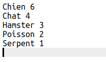
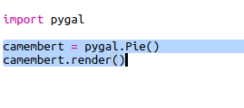
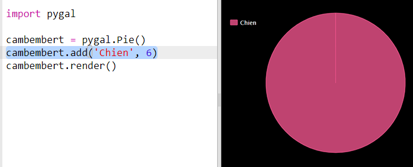
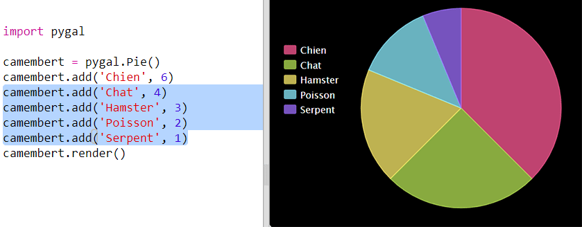
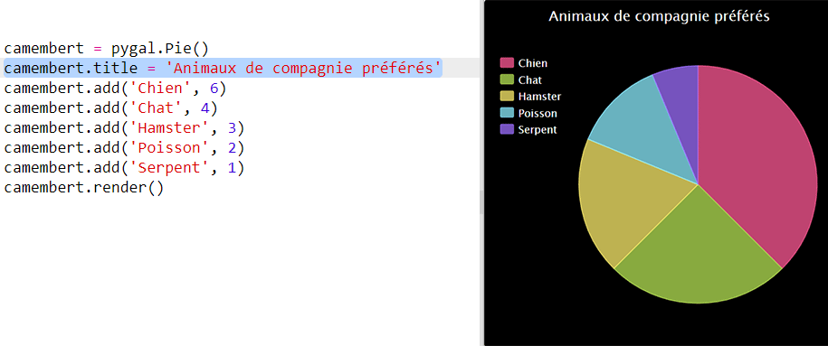

## Créer un camembert

Les camemberts sont un moyen utile d’afficher des données. Faisons une enquête sur les animaux de compagnie préférés dans ton Code Club, puis présentons les données sous forme de camembert.

+ Demande à ton responsable de club de t'aider à organiser une enquête. Tu peux enregistrer les résultats sur un ordinateur connecté à un projecteur ou à un tableau blanc visible par tout le monde.
    
    Rédige une liste d'animaux de compagnie et assures-toi que les animaux préférés de tout le monde sont inclus.
    
    Demande ensuite à chacun de voter pour son favori en levant la main au moment de l'appel. Un seul vote chacun !
    
    Par exemple :
    
    

+ Ouvre le modèle de Trinket Python vierge : <a href="http://jumpto.cc/python-new" target="_blank">jumpto.cc/python-new</a>.

+ Créons un camembert montrant les résultats de ton enquête. Tu utiliseras la bibliothèque PyGal pour effectuer une partie du travail compliqué.
    
    Commence par importer la bibliothèque Pygal :
    
    

+ Créons maintenant un camembert et affiche-le :
    
    
    
    Ne t’inquiètes pas, cela devient plus intéressant lorsque tu ajoutes des données !

+ Ajoutons les données pour l'un des animaux de compagnie. Utilise les données que tu as collectées.
    
    
    
    Il n’y a qu’une seule donnée, elle occupe donc tout le camembert.

+ Ajoute maintenant le reste des données de la même manière.
    
    Par exemple :
    
    

+ Et pour finir ton graphique, ajoute un titre :
    
    