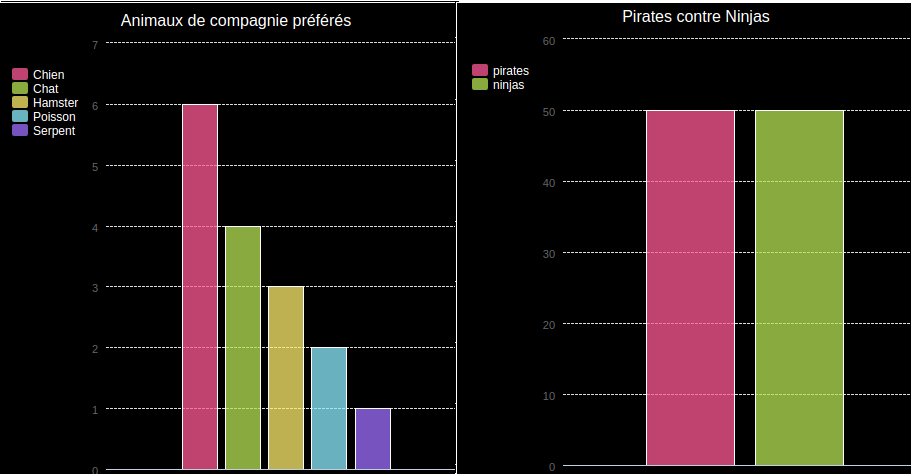

\--- challenge \---

## Défi : Crée ton histogramme

Tu peux créer des histogrammes de la même manière. Il te suffit d'utiliser `histogramme = pygal.Bar ()` pour créer un nouvel histogramme, puis ajoute des données et effectue l'affichage de la même manière que pour un camembert.

Recueille des données auprès de tes membres du Code Club pour créer ton histogramme.

Assures-toi de choisir un sujet avec lequel tout le monde est familier !

Voici quelques idées:

+ Quel est ton sport favori ?
+ Quel est ton parfum de glace préféré ?
+ Comment vas-tu à l'école ?
+ Quel est le mois de ton anniversaire ?
+ Joues-tu à Minecraft ? (Oui/Non)

Ne pose pas de questions révélant des données personnelles telles que le lieu de résidence des participants. Demande à ton responsable de club si tu n'es pas sûr(e).

Exemples :

\--- /challenge \---