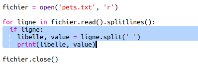
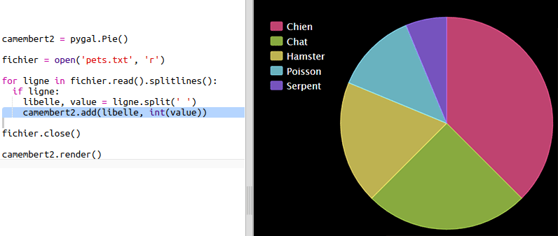

## Lire des données à partir d'un fichier

C'est pratique de pouvoir stocker des données dans un fichier plutôt qu'à l'intérieur de ton code.

+ Ajoute un nouveau fichier à ton projet et nomme-le `pets.txt` :

  

+ Maintenant ajoute des données à l'intérieur du fichier. Tu peux utiliser les informations concernant les animaux de compagnie préférés que tu as recueillies ou d'autres exemples de données.

  

+ Revient vers `main.py` et transformer en commentaire les lignes qui rendent (affichent) les représentations graphiques (pour qu'elles ne s'affichent pas) :

  

+ Maintenant lisons les données à partir du fichier.

  

  La boucle `for` s'exécutera en continu les lignes dans le fichier. `splitlines()` enlève le charactère/symbole pour une nouvelle ligne de la fin de chaque ligne car tu t'en sers pas.

+ Chaque ligne doit être séparé dan un label et une valeur :

  

  Ceci va scinder les lignes au niveau des espaces, donc il ne faut pas inclure des espaces dans les labels. (Tu pourrais ajouter une méthode pour traiter les espaces dans les labels plus tard.)

+ Tu recevras peut-être un message d'erreur comme le suivant :

  

  Ça arrive si tu as une ligne vide à la fin de ton fichier.

  Tu peux corriger l'erreur en cherchant le label et valeur uniquement si la ligne n'est pas vide.

  Pour ce faire, décaler le code à l'intérieur de la boucle `for` et ajoute le code `if line:` en-dessus :

  

+ Tu peux retirer la ligne `print(label, value)` maintenant que tout marche correctement.

+ Maintenant ajoutons le label et la valeur dans un nouveau camembert et rend les données pour les visualiser :

  

  A noter que `add` attend en entrée une valeur qui est un numéro, `int(value)` transforme la valeur d'une chaîne de charactères dans un integer.

  Si tu voulais utiliser des décimals comme 3.5 ("floating point numbers") tu pourrais utiliser `float(value)` à la place.
