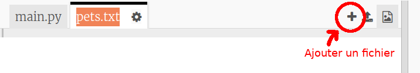
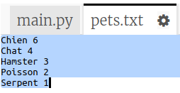
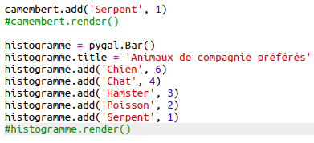
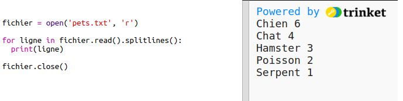
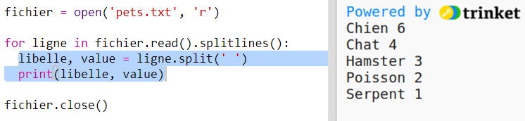
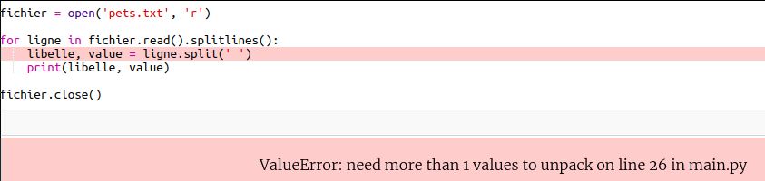
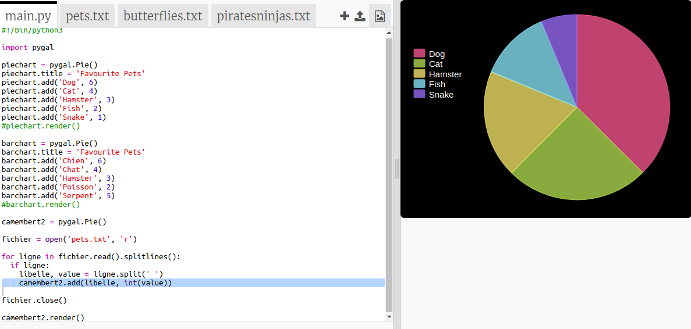

## Lire les données à partir d'un fichier

Il est utile de pouvoir stocker des données dans un fichier plutôt que de les inclure dans ton code.

+ Ajoute un nouveau fichier à ton projet et appelle-le `pets.txt`:
    
    

+ Ajoute maintenant des données au fichier. Tu peux utiliser les données des animaux de compagnie que tu as collectées ou les exemples de données.
    
    

+ Reviens à `main.py` et commente les lignes qui affichent les camemberts et les histogrammes (de sorte qu'ils ne sont pas affichés):
    
    

+ Lisons maintenant les données à partir du fichier.
    
    
    
    La boucle `for` passera en boucle sur toutes les lignes du fichier. `splitlines()` supprime le caractère de retour à la ligne de la fin de la ligne car tu ne souhaites pas le conserver.

+ Chaque ligne doit être séparée entre un libellé et une valeur :
    
    
    
    Cela divisera la ligne au niveau des espaces, alors n'inclus pas d'espaces dans les libellés. (Tu pourras ajouter ultérieurement une prise en charge des espaces dans les libellés.)

+ Tu pourrais obtenir une erreur comme ceci :
    
    
    
    Cela se produit si tu as une ligne vide à la fin de ton fichier.
    
    Tu peux corriger l'erreur en récupérant uniquement le libellé et la valeur si la ligne n'est pas vide.
    
    Pour ce faire, indente le code dans ta boucle `for` et ajoute le code `if line:` juste avant :
    
    

+ Tu peux supprimer la ligne `print(label, value)` maintenant que tout fonctionne.

+ Ajoutons maintenant le libellé et la valeur à un nouveau camembert et affichons-le:
    
    
    
    Note que `add` suppose que la valeur est un nombre, `int (value)` transforme la valeur d'une chaîne de caractères en un entier.
    
    Si tu souhaites utiliser des nombres décimaux tels que 3.5 (nombres à virgule flottante), tu peux utiliser `float (value)` à la place.