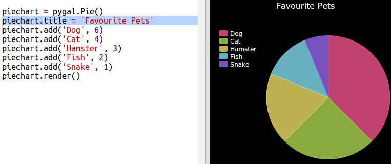

## एक पाई चार्ट बनाएं

पाई चार्ट डेटा दिखाने का उपयोगी तरीका है। आइए आपके Code Club में पसंदीदा पालतू जानवरों का सर्वेक्षण करें और फिर डेटा को पाई चार्ट के रूप में प्रस्तुत करें।

+ अपने क्लब लीडर से एक सर्वेक्षण आयोजित करने में मदद करने के लिए कहें। आप प्रोजेक्टर या व्हाइटबोर्ड से जुड़े कंप्यूटर पर परिणाम रिकॉर्ड कर सकते हैं जिसे हर कोई देख सकता है।
    
    पालतू जानवरों की एक सूची लिखें और सुनिश्चित करें कि सभी का पसंदीदा जानवर शामिल है।
    
    फिर सभी को अपने पसंदीदा के लिए वोट करने के लिए कहें, जब उसका नाम बुलाया जाए, तो अपना हाथ ऊपर कर दें। प्रत्येक को केवल एक वोट!
    
    उदाहरण के लिए:
    
    

+ खाली Python नमूना trinket खोलें: <a href="http://jumpto.cc/python-new" target="_blank">jumpto.cc/python-new</a>|

+ आइए अपने सर्वेक्षण के परिणामों को दिखाने के लिए एक पाई चार्ट बनाएं। आप कुछ कठिन परिश्रम करने के लिए PyGal लाइब्रेरी का उपयोग करेंगे।
    
    पहले Pygal लाइब्रेरी आयात करें:
    
    

+ अब एक पाई चार्ट बनाते हैं और इसे प्रदर्शित करते हैं:
    
    
    
    चिंता न करें, जब आप डेटा जोड़ते हैं तो यह अधिक दिलचस्प हो जाता है!

+ चलो पालतू जानवरों में से एक के लिए डेटा जोड़ें। आपके द्वारा एकत्र किए गए डेटा का उपयोग करें।
    
    
    
    अभी डेटा का केवल एक टुकड़ा है, इसलिए यह पूरे पाई चार्ट को लेता है।

+ अब उसी तरह से बाकी डेटा भी जोड़ें।
    
    उदाहरण के लिए:
    
    

+ और अपना चार्ट समाप्त करने के लिए, शीर्षक जोड़ें:
    
    