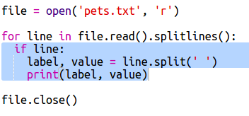

## फाइल से डेटा पढ़ें

डेटा को अपने कोड में शामिल करने के बजाय इसे फाइल में स्टोर करना उपयोगी होता है।

+ अपने प्रोजेक्ट में नई फाइल जोड़ें और इसे `pets.txt` नाम दें:

  

+ अब फाइल में डेटा जोड़ें। आप अपने पसंदीदा पालतू जानवर के डेटा या उदाहरण के डेटा का उपयोग कर सकते हैं।

  

+ वापस `main.py` पर स्विच करें और ऐसी पंक्तियों में कमेन्ट जोड़ें जो चार्ट और ग्राफ प्रदर्शित (डिस्प्ले) करें (ताकि वे डिस्प्ले न हों):

  

+ अब चलिए फाइल से डेटा पढ़ें।

  

  `for` (के लिए) लूप फाइल में पंक्तियों में लूप लगा देगा। `splitlines()` (लाइनें विभाजित करें) पंक्ति के अंत से नई पंक्ति का कैरेक्टर हटा देता है, क्योंकि आप इसे नहीं चाहते।

+ प्रत्येक पंक्ति को लेबल और मान में अलग किया जाना चाहिए:

  

  लेबल में स्पेस से पंक्ति कई जगहों से विभाजित हो जाएगी, इसलिए इसे शामिल न करें। (आप बाद में लेबल्स में स्पेस के लिए सहायता जोड़ सकते हैं।)

+ आपके सामने ऐसी त्रुटि आ सकती है:

  

  ऐसा तब होता है, जब आपकी फाइल के अंत में खाली पंक्ति होती है।

  सूची खाली न होने की स्थिति में, आप इस त्रुटि को लेबल और मान द्वारा ठीक कर सकते हैं।

  ऐसा करने के लिए, अपने `for` लूप के अंदर कोड में जगह छोड़ें और इसके ऊपर `if line:` (अगर लाइन:) कोड जोड़ें।:

  

+ अब आप `print(label, value)` (प्रिंट करें(लेबल, मान)) पंक्ति को हटा सकते हैं, सब कुछ ठीक काम कर रहा है।

+ चलिए अब नए पाई चार्ट में लेबल और मान जोड़ें और इसे प्रदर्शित करें:

  

  ध्यान दें कि `add` (जोड़ें) मान के संख्या होने की अपेक्षा करता है, `int(value)` (इंटीजर(मान)) मान को स्ट्रिंग से इंटीजर में बदलता है।

  यदि आप 3.5 (फ्लोटिंग पॉइंट संख्याएँ) की तरह दशमलव उपयोग करना चाहते हैं, तो आप `float(value)` उपयोग कर सकते हैं।

