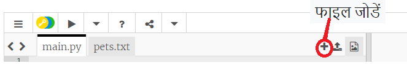
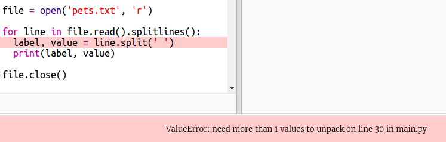

## एक फ़ाइल से डेटा पढ़ें

अपने कोड में इसे शामिल करने के बजाय किसी फ़ाइल में डेटा संग्रहीत करना उपयोगी है।

+ अपनी प्रोजैक्ट में एक नई फ़ाइल जोड़ें और इसे `pets.txt` कॉल करें:
    
    

+ अब फ़ाइल में डेटा जोड़ें। आप पसंदीदा पालतू जानवर डेटा का उपयोग कर सकते हैं जिसे आपने एकत्र किया था या उदाहरण डेटा।
    
    

+ वापस `main.py` जाओ और उन लाइनों को comment out करो जो चार्ट (प्रदर्शन) और ग्राफ़ प्रस्तुत करती हैं (ताकि वे प्रदर्शित न हों):
    
    

+ अब फाइल से डेटा पढ़ते हैं।
    
    
    
    `for` लूप फ़ाइल में लाइनों पर लूप होगा। `splitlines ()` पंक्ति के अंत से न्यूलाइन वर्ण को हटा देता है। जैसा कि आप नहीं चाहते हैं|

+ प्रत्येक पंक्ति को एक लेबल और एक value में अलग करने की आवश्यकता है:
    
    
    
    यह रिक्त स्थान पर लाइन को विभाजित करेगा ताकि लेबल में रिक्त स्थान शामिल न हों। (आप बाद में लेबल में रिक्त स्थान के लिए समर्थन जोड़ सकते हैं।)

+ आपको इस प्रकार की एक त्रुटि मिल सकती है:
    
    
    
    ऐसा तब होता है जब आपकी फाइल के अंत में एक खाली लाइन होती है।
    
    यदि लाइन खाली नहीं है, तो आप केवल label और value प्राप्त करके त्रुटि को ठीक कर सकते हैं।
    
    ऐसा करने के लिए, अपने `for` लूप के अंदर के कोड को इंडेंट करें और `if line:` जोड़ें पंक्ति के ऊपर:
    
    

+ अब आप `print(label, value)` लाइन को हटा सकते हैं अब सब कुछ काम कर रहा है।

+ अब एक नए पाई चार्ट में लेबल और value जोड़ें और इसे प्रस्तुत करें:
    
    
    
    ध्यान दें कि `add` value के संख्या होने की उम्मीद है, `int (value)` एक स्ट्रिंग से value को पूर्णांक में बदल देता है।
    
    अगर आप दशमलव उपयोग करना चाहते थे जैसे 3.5 (चल बिन्दु संख्या) उसके लिए इस का उपयोग करें `float(value)`