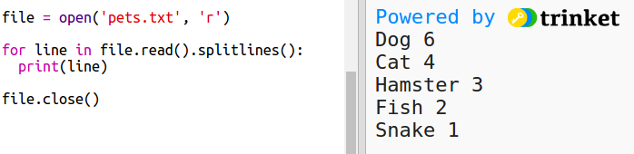

## एक फ़ाइल से डेटा पढ़ें

डेटा को अपने कोड में शामिल करने के बजाय फ़ाइल में संग्रहीत करने में सक्षम होना उपयोगी है।

+ अपने प्रोजेक्ट में एक नई फ़ाइल जोड़ें और इसे `pets.txt` कहें:
    
    

+ अब फ़ाइल में डेटा जोड़ें। आप पसंदीदा पालतू जानवर डेटा का उपयोग कर सकते हैं जिसे आपने एकत्र किया था या उदाहरण डेटा।
    
    

+ `main.py` पर वापिस जाइये और उन लाइनों को कमेंट कीजिये जो चार्ट और ग्राफ़ प्रस्तुत करती हैं (ताकि वे प्रदर्शित न हों):
    
    

+ अब फाइल से डेटा पढ़ते हैं।
    
    
    
    `for` लूप फ़ाइल में पंक्तियों पर लूप होगा। `splitlines()` पंक्ति के अंत से न्यूलाइन वर्ण को हटा देता है क्योंकि आप उन्हें नहीं चाहते हैं।

+ प्रत्येक पंक्ति को एक लेबल और एक मान में विभाजित करने की आवश्यकता है:
    
    
    
    यह रिक्त स्थान पर पंक्ति को विभाजित करेगा इसलिए लेबल में रिक्त स्थान शामिल न करें। (आप बाद में लेबल में रिक्त स्थान के लिए समर्थन जोड़ सकते हैं।)

+ आपको इस प्रकार की एक त्रुटि मिल सकती है:
    
    
    
    ऐसा तब होता है जब आपकी फाइल के अंत में एक खाली पंक्ति होती है।
    
    यदि पंक्ति खाली नहीं है, तो ही आप लेबल और मान प्राप्त करके त्रुटि को ठीक कर सकते हैं।
    
    ऐसा करने के लिए, अपने `for` लूप के अंदर के कोड को इंडेंट करें और `if line:` कोड के ऊपर जोड़ें:
    
    

+ अब आप `print(label, value)` पंक्ति को हटा सकते हैं अब सब कुछ काम कर रहा है।

+ अब एक नए पाई चार्ट में लेबल और मान जोड़ते हैं और इसे प्रस्तुत करते हैं:
    
    
    
    ध्यान दें कि `add` मान के संख्या होने की उम्मीद करता है, `int(value)` एक स्ट्रिंग से मान में बदल देता है।
    
    अगर आप दशमलव उपयोग करना चाहते थे जैसे 3.5 (चल बिन्दु संख्या) उसके लिए इस का उपयोग करें `float(value)`|