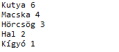
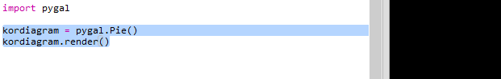
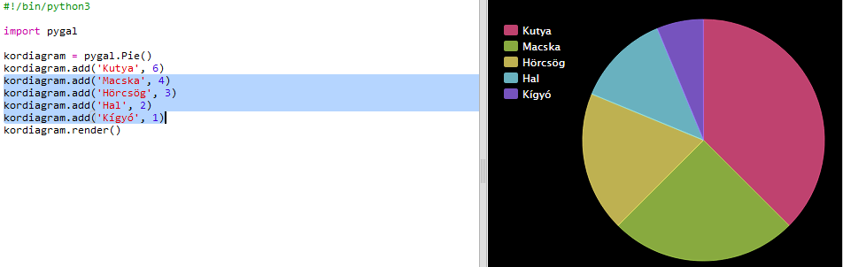
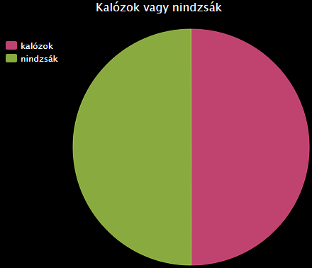

# Bevezetés {.intro}

Ebben a projektben kördiagramokat és oszlopdiagramokat fogsz létrehozni azokból az adatokból, amelyeket a Code Club-od tagjaitól gyűjtesz össze.

  <iframe src="https://trinket.io/embed/python/70d24d92b8?outputOnly=true&start=result" width="600" height="500" frameborder="0" marginwidth="0" marginheight="0" allowfullscreen>
  </iframe>
  

# 1. lépés: Készíts kördiagramot {.activity}

A kördiagramokat az adatok megjelenítésére használjuk. Készítsünk egy felmérést a kedvenc háziállataidról a Code Club-ban, majd mutassuk be az adatokat kördiagramként.

## Lista a teendőkről {.check}

+ Kérd meg az önkéntesedet, hogy segítsen egy felmérés megszervezésében. Az eredményeket rögzítheted egy projektorhoz csatlakoztatott számítógépen vagy egy táblán, amelyet mindenki láthat.
    
    Készíts egy listát a háziállatokról és győződj meg róla, hogy mindenkinek a kedvence rajta van a listán.
    
    Ezután kérj meg mindenkit, hogy szavazzon a kedvencére kézfelemeléssel, amikor a kedvencét mondják be. Mindenkinek csak egy szavazata van!
    
    Például:
    
    

+ Nyisd meg az üres Python trinket sablont: <a href="http://jumpto.cc/python-new" target="_blank">jumpto.cc/python-new</a>.

+ Készíts egy kördiagramot a felmérésed eredményeinek bemutatására. A PyGal könyvtárat fogod használni a kemény munka egy részéhez.
    
    Először importáld a Pygal könyvtárat:
    
    

+ Most készíts egy kördiagramot, és rendereld (jelenítsd meg a kijelződön):
    
    
    
    Ne aggódj, sokkal érdekesebbé válik, amikor hozzáadod az adatokat!

+ Add hozzá az adatokat az egyik háziállathoz. Használd az adatokat, amiket összegyűjtöttél.
    
    
    
    Csak egy adat van, tehát az egész kördiagramot ez tölti ki.

+ Most ugyanígy add hozzá a többi adatot.
    
    Például:
    
    

+ És a diagram befejezéséhez adj neki egy címet (title):
    
    

## Mentsd el a projektedet {.save}

## Kihívás: Készítsd el saját oszlopdiagramodat {.challenge}

Oszlopdiagramokat hasonló módon tudsz létrehozni. Csak használd az `oszlopdiagram = pygal.Bar ()` kódot új oszlopdiagram létrehozásához, majd add hozzá az adatokat és rendereld ugyanúgy, mint a kördiagramnál.

Gyűjts adatokat a Code Club tagjaitól a saját oszlopdiagramod elkészítéséhez.

Győződj meg róla, hogy olyan témát választasz, amit mindenki ismer!

Íme néhány ötlet:

+ Mi a kedvenc sportod?

+ Melyik fagylalt a kedvenced?

+ Hogyan jársz iskolába?

+ Melyik hónapban van a szülinapod?

+ Játszol a Minecrafttal? (igen/nem)

Ne tegyél fel olyan kérdéseket, amelyek személyes adatot tartalmaznak, például, hogy ki hol lakik. Ha nem vagy biztos benne, kérdezd meg a Code Club vezetőjét.

Példák:

## Mentsd el a projektedet {.save}

# 2. lépés: Olvass adatot egy fájlból {.activity}

Hasznos, ha az adatokat fájlban tudod tárolni, ahelyett, hogy azokat bele kellene foglalnod a kódodba.

## Lista a teendőkről {.check}

+ Adj hozzá egy új fájlt a projektedhez, és nevezd el `pets.txt`-nek:
    
    

+ Most adj adatot a fájlhoz. Használhatod a kedvenc háziállatok adatait, amit összegyűjtöttél, vagy a példaadatokat.
    
    

+ Válts vissza `main.py` -ra, és 'kommenteld ki' azokat a sorokat, amelyek renderelik (megjelenítik) a grafikonokat (hogy azok ne jelenjenek meg):
    
    

+ Most olvasd ki az adatokat a fájlból.
    
    
    
    A `for` ciklus végigmegy a fájl minden során. A `splitlines()` eltávolítja az új sor karaktert a sor végéről, mivel ezt nem akarod.

+ Minden egyes sort szét kell választani címkére és értékre:
    
    
    
    Ez szétválasztja a sort a szóközöknél, tehát ne adj hozzá szóközt a címkékben. (Később hozzáadhatsz támogatást a szóközökhöz a címkékben.)

+ Előfordulhat egy ilyen hiba:
    
    
    
    Ez akkor fordul elő, ha üres sor van a fájl végén.
    
    A hibát kijavíthatod, ha meggyőződsz róla, hogy csak akkor kapod meg a címkét és az értéket, ha a sor nem üres.
    
    Ehhez húzd be a kódot a `for` ciklusban, és add hozzá az `if line:` sort:
    
    

+ Eltávolíthatod a `print(cimke, ertek)` sort, most minden működik.

+ Most add hozzá a címkét és az értéket egy új kördiagramhoz, és rendereld:
    
    
    
    Ne feledd, hogy az `add` elvárja, hogy az érték szám legyen, az `int(value)` az értéket egy karakterláncból egész számra változtatja.
    
    Ha tizedes értékű számokat szeretnél használni, mint például a 3.5 (lebegőpontos számok), akkor használhatod a `float(value)` kódot helyette.

## Mentsd el a projektedet {.save}

## Kihívás: Készíts új diagramot egy fájlból {.challenge}

Tudsz új oszlopdiagramot vagy kördiagramot készíteni egy fájl adataiból? Új .txt fájlt kell létrehoznod.

Tipp: Ha szeretnél szóközöket a címkékben, akkor használd a `line.split (': ')` kódot, és adj kettőspontokat az adatfájlhoz, pl. „Kis ökörszemlepke: 4”

## Mentsd el a projektedet {.save}

## Kihívás: Még több grafikon! {.challenge}

Tudsz kördiagramot és oszlopdiagramot létrehozni ugyanabból a fájlból? Használhatod az adatot, amit korábban összegyűjtöttél, vagy gyűjthetsz új adatot.

## Mentsd el a projektedet {.save}