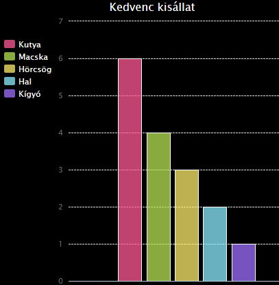

## Bevezetés

Ebben a projektben kördiagramokat és oszlopdiagramokat fogsz létrehozni azokból az adatokból, amelyeket a Code Club-od tagjaitól gyűjtesz össze.

### Utasítások

Amikor a 'Run'-ra kattintasz, az adatokból diagramok jönnek létre a PyGal python modul segítségével.

  <iframe src="https://trinket.io/embed/python/70d24d92b8?outputOnly=true&start=result" width="600" height="500" frameborder="0" marginwidth="0" marginheight="0" allowfullscreen>
  </iframe>
  

### Amit meg fogsz tanulni

Ez a projekt a [Raspberry Pi Digitális Alkotás Tanterv](http://rpf.io/curriculum) alábbi részeiből fed le elemeket:

+ [Kombinálj programszerkezeteket a probléma megoldásához.](https://www.raspberrypi.org/curriculum/programming/builder/)

### További információk oktatóknak

Ha ki szeretnéd nyomtatni ezt a projektet, kérjük, használd a [nyomtatóbarát verziót](https://projects.raspberrypi.org/en/projects/popular-pets/print) {:target="_blank"}.

Használd a láblécben lévő linket az ehhez a projekthez tartozó GitHub tárhely eléréséhez, amely az 'en/resources' mappában az összes segédanyagot (beleértve egy befejezett mintaprojektet is) tartalmazza.