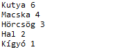
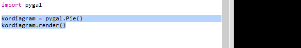
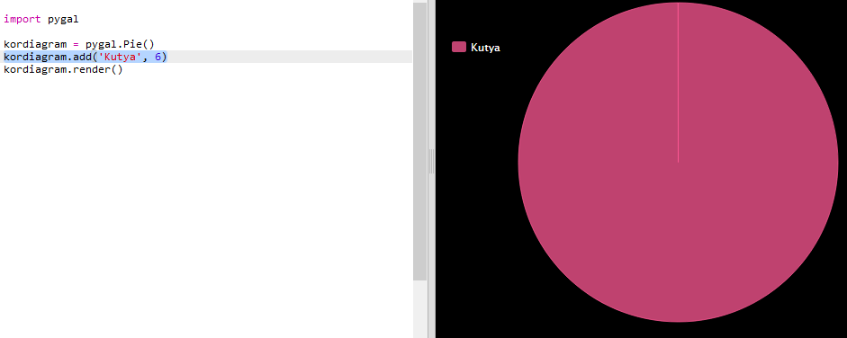
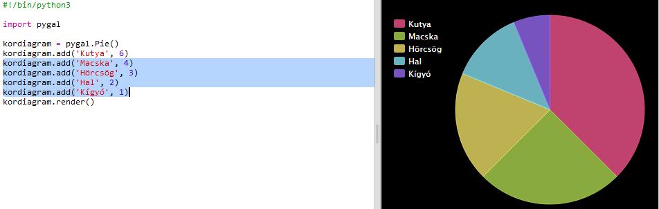
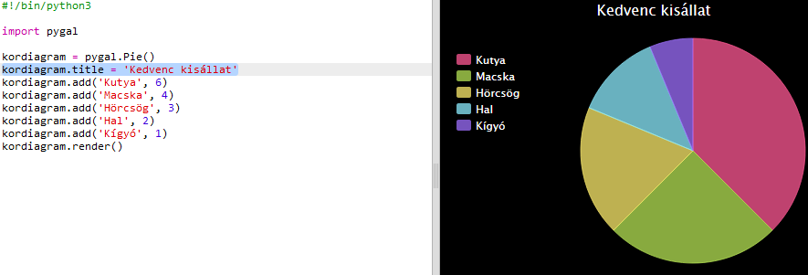

## Készíts kördiagramot

A kördiagramokat az adatok megjelenítésére használjuk. Készíts egy felmérést a kedvenc háziállatokról a Code Club-ban, majd mutasd be be az adatokat kördiagramként.

+ Kérd meg a Code Club vezetőjét, hogy segítsen egy felmérés megszervezésében. Az eredményt rögzítheted egy projektorhoz csatlakoztatott számítógépen vagy egy táblán, amelyet mindenki láthat.
    
    Készíts egy listát a háziállatokról és győződj meg róla, hogy mindenkinek a kedvence rajta van a listán.
    
    Ezután kérj meg mindenkit, hogy szavazzon a kedvencére kézfelemeléssel, amikor a kedvencét mondják be. Mindenkinek csak egy szavazata van!
    
    Például:
    
    

+ Nyisd meg az üres Python trinket sablont: <a href="http://jumpto.cc/python-new" target="_blank">jumpto.cc/python-new</a>.

+ Készíts kördiagramot a felmérés eredményének a bemutatására. A PyGal könyvtárat fogod használni a kemény munka egy részéhez.
    
    Először importáld a Pygal könyvtárat:
    
    

+ Most készíts egy kördiagramot, és rendereld (jelenítsd meg a kijelződön):
    
    
    
    Ne aggódj, sokkal érdekesebbé válik amikor hozzáadod az adatokat!

+ Add hozzá az egyik háziállat adatait. Használd az összegyűjtött adatokat.
    
    
    
    Csak egy adat van, tehát az egész kördiagramot ez tölti ki.

+ Most ugyanígy add hozzá a többi adatot.
    
    Például:
    
    

+ És a diagram befejezéséhez adj neki egy címet (title):
    
    