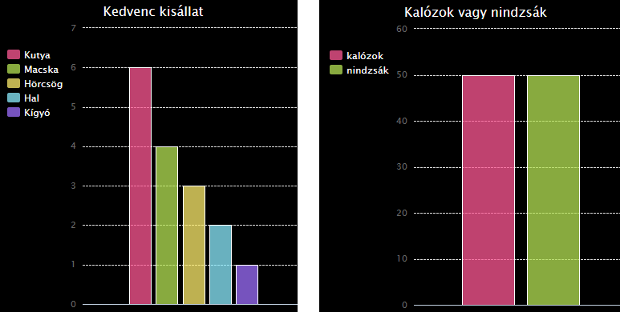

\--- challenge \---

## Kihívás: Készítsd el saját oszlopdiagramodat

Hasonló módon készíthetsz oszlopdiagramokat. Csak használd az `oszlopdiagram = pygal.Bar ()` kódot új oszlopdiagram létrehozásához, majd add hozzá az adatokat és rendereld ugyanúgy, mint a kördiagramnál.

Gyűjts adatokat a Code Club tagjaitól a saját oszlopdiagramod elkészítéséhez.

Győződj meg róla, hogy olyan témát választasz, amit mindenki ismer!

Íme néhány ötlet:

+ Mi a kedvenc sportod?
+ Melyik fagylalt a kedvenced?
+ Hogyan jársz iskolába?
+ Melyik hónapban van a szülinapod?
+ Játszol a Minecrafttal? (igen/nem)

Ne tegyél fel olyan kérdést, ami személyes adatot tartalmaz, például, hogy ki hol lakik. Kérdezd meg a klub vezetõjét, ha nem vagy biztos benne.

Példák:

\--- /challenge \---