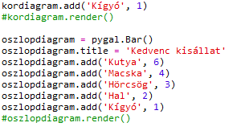
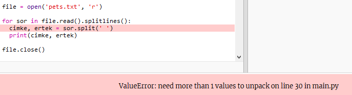
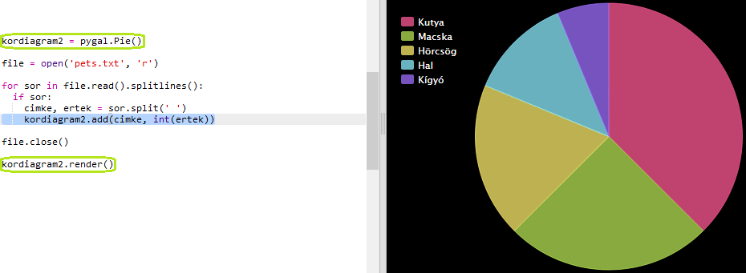

## Olvass adatot egy fájlból

Hasznos, ha az adatokat fájlban tudod tárolni, ahelyett, hogy azokat bele kellene foglalnod a kódodba.

+ Adj hozzá egy új fájlt a projektedhez, és nevezd el `pets.txt`-nek:
    
    

+ Most adj hozzá adatot a fájlhoz. Használhatod a kedvenc háziállatok adatait, amit összegyűjtöttél, vagy a példaadatokat.
    
    

+ Válts vissza `main.py` -ra, és 'kommenteld ki' azokat a sorokat, amelyek renderelik (megjelenítik) a grafikonokat (hogy azok ne jelenjenek meg):
    
    

+ Most olvasd ki az adatokat a fájlból.
    
    
    
    A `for` ciklus végigmegy a fájl minden során. A `splitlines()` eltávolítja az új sor karaktert a sor végéről, mivel ezt nem akarod.

+ Minden egyes sort szét kell választani címkére és értékre:
    
    
    
    Ez szétválasztja a sort a szóközöknél, tehát ne adj hozzá szóközt a címkékben. (Később hozzáadhatsz támogatást szóközökhöz a címkékben.)

+ Előfordulhat egy ilyen hiba:
    
    
    
    Ez akkor fordul elő, ha üres sor van a fájl végén.
    
    A hibát kijavíthatod, ha meggyőződsz róla, hogy csak akkor kapod meg a címkét és az értéket, ha a sor nem üres.
    
    Ehhez húzd be a kódot a `for` ciklusban, és add hozzá az `if line:` sort:
    
    

+ Eltávolíthatod a `print(cimke, ertek)` sort, most minden működik.

+ Most add hozzá a címkét és az értéket egy új kördiagramhoz, és rendereld:
    
    
    
    Ne feledd, hogy az `add` elvárja, hogy az érték szám legyen, az `int(value)` az értéket egy karakterláncból egész számra változtatja.
    
    Ha tizedes értékű számokat szeretnél használni, mint például a 3.5 (lebegőpontos számok), akkor használhatod a `float(value)` kódot helyette.